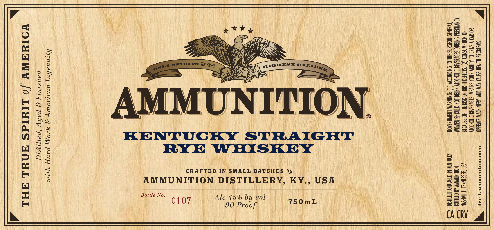

# TTB COLA Label Images - TTBID 26035001000169

**Brand Name:** AMMUNITION

**Fanciful Name:** KENTUCKY STRAIGHT RYE WHISKEY

**Issue Date:** 02/13/2026

**Origin Code:** 43

**Product Class/Type:** 102

**Source:** [TTB Public COLA Registry](https://ttbonline.gov/colasonline/viewColaDetails.do?action=publicFormDisplay&ttbid=26035001000169)

## Label Images

### Label 1

### Label 2

## Extracted Label Text

*Text extracted via OCR - may contain errors*

### Label 1

Kee y

Se5

=

oa

Bes

ie

e2 =>

Saf.

ae

*

SS

AwsaBsssSs

m2

mS

se

PICHEST ©

oa

eS

ae

es

Se!

=a

Sesorss

Sass

a ae

Sa S=

Bes

=e=

say

s—

=2

BaSevwsez

Ss

eauc=2

ea

ess

AMMUNITION

Boo

|

eee

2 2 aoe

S25

ss

o>

zs

7-4

KENTUCKY STRAIGHT

RYE WHISKEY

Sa=S

CRAFTED IN SMALL BATCHES by

aS

seu

Sa2R

AMMUNITION DISTILLERY, KY., USA

i

Sur

Bottle No.

——!

107

Alc 45% by vol

750mL

Zsa

a=

90 Proof

CA CRV

### Label 2

ESS

ay

e)

(PH

SSS

HSS

D orm

SS

HSS

Gm

SS

uae

ELUTE EELUEELULEOLULEOLUEOPOLEOTOLUOLOLUMEULEREOLULOPEUOLUUOPUOUOPUUL TLL TULUL ILOILO LUO

*

PRODUCED IN SMALL BATCHES

*

*

ITH ZERO B

VUTEC ECT DE TE EETECETCEEEEECETECEDEEee

av;

7

Ts ™

x

Zs x

i

Ts
