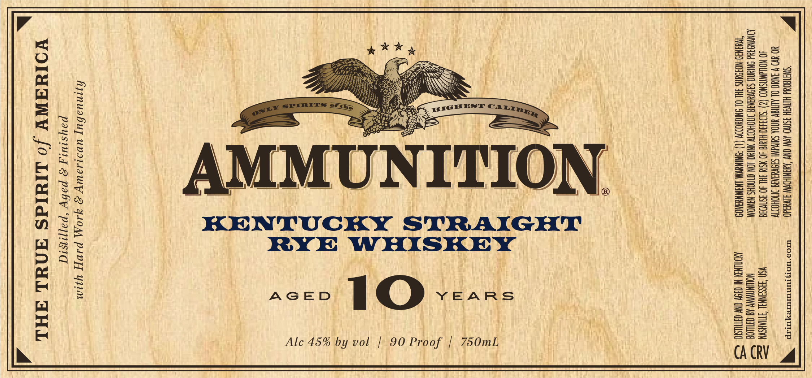

# TTB COLA Label Images - TTBID 26035001000173

**Brand Name:** AMMUNITION

**Fanciful Name:** KENTUCKY STRAIGHT RYE WHISKEY AGED 10 YEARS

**Issue Date:** 02/13/2026

**Origin Code:** 43

**Product Class/Type:** 102

**Source:** [TTB Public COLA Registry](https://ttbonline.gov/colasonline/viewColaDetails.do?action=publicFormDisplay&ttbid=26035001000173)

## Label Images

### Label 1

### Label 2

## Extracted Label Text

*Text extracted via OCR - may contain errors*

### Label 1

W “SWATGON HLTVGH 3SNV9 AVW CNY AXSNIKDWW SIVYR40 -— WrOo"NomsrMuTuTexTEp “
YO UD V IAUO OL ALTIGV UNDA SdIvalNl S3OVUIAIE IMOHODTV

40 WOUAWNSNOD (2) "S1o3430-HIG 40 NStd 3AL 40 aSn\038 VSN S3SSHNNAL TTIAHSYN Ee

JONYNS dd ONIANC SIVUVTE SOHO WNYC LON CTNCHS NAWOM NOWNAWWY AB CHILOG $=

“TWHHN9:NOOUNS 3HL OL ONIOYODDV (1) -ONINAVM LNGWNY3K09 MONEY NOY ON TUSK. SS

Alc 45% by vol | 90 Proof | 750mL,

:
0
Ae
a
ce
» bi
=
:

Zz
<
EJ
am
<
=
*

hjinuabuy uvs1sauy 2 YlOM PAVE] yum
paysiuty 2 paby “pappisid
VOINAWY /o LIYIdS ANUL AML S

### Label 2

ESS

ay

e)

(PH

SSS

HSS

D orm

SS

HSS

Gm

SS

uae

ELUTE EELUEELULEOLULEOLUEOPOLEOTOLUOLOLUMEULEREOLULOPEUOLUUOPUOUOPUUL TLL TULUL ILOILO LUO

*

PRODUCED IN SMALL BATCHES

*

*

ITH ZERO B

VUTEC ECT DE TE EETECETCEEEEECETECEDEEee

av;

7

Ts ™

x

Zs x

i

Ts
