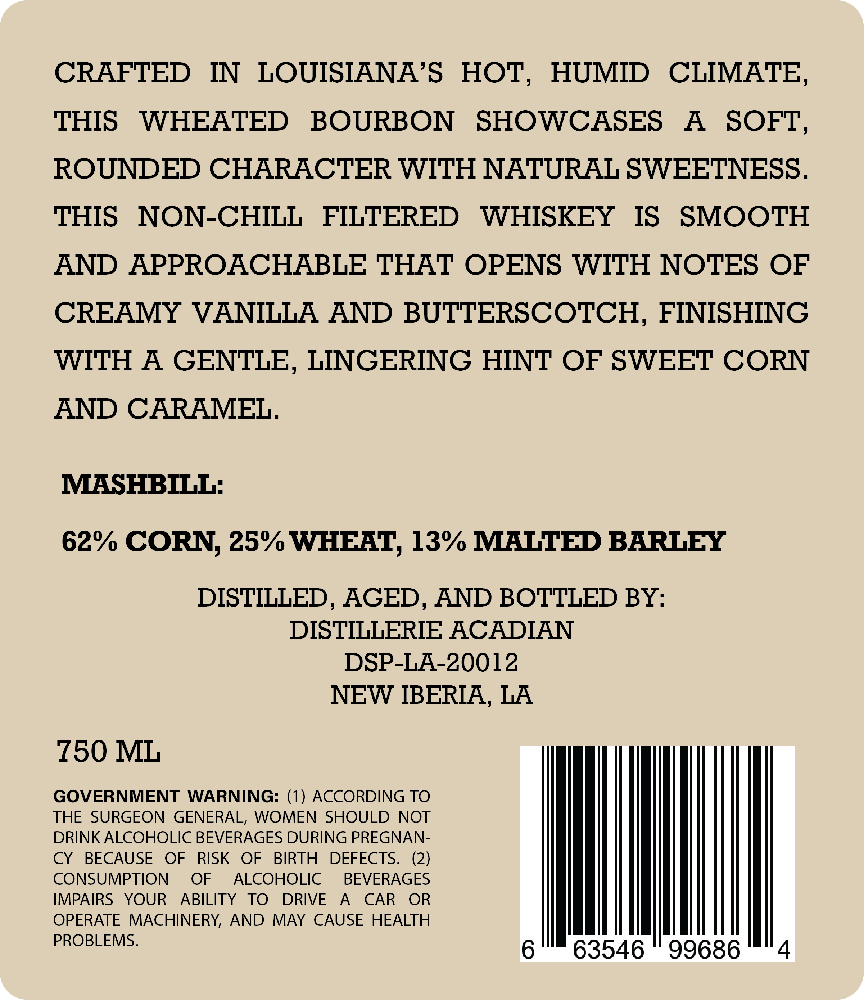
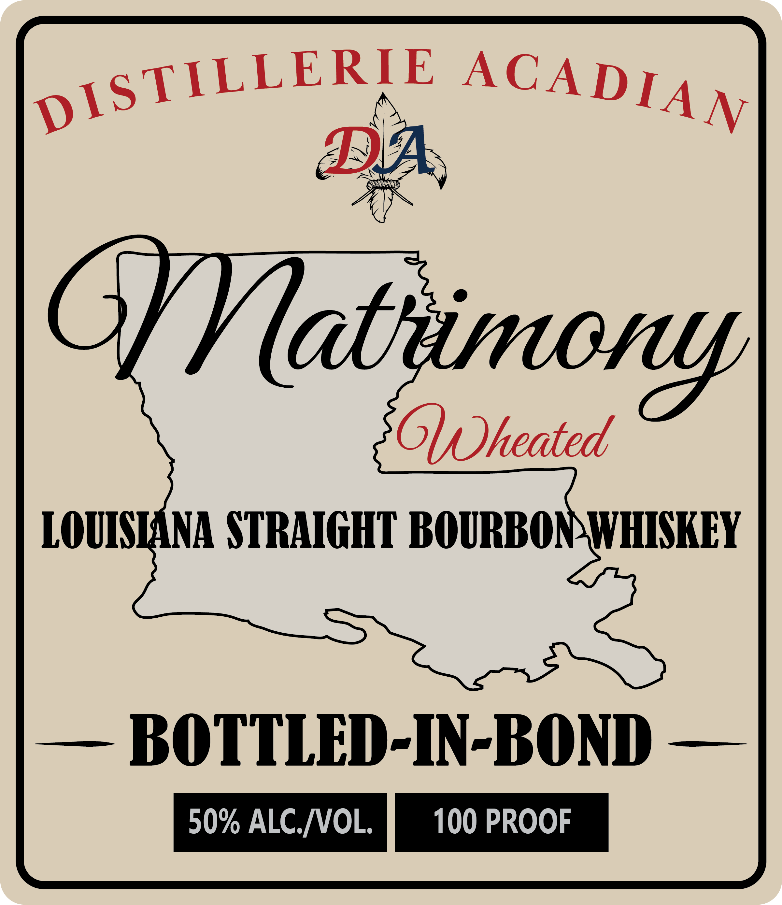
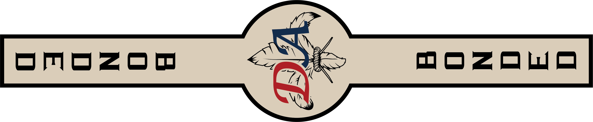

# TTB COLA Label Images - TTBID 26035001000227

**Brand Name:** DISTILLERIE ACADIAN

**Fanciful Name:** MATRIMONY

**Issue Date:** 02/09/2026

**Origin Code:** 23

**Product Class/Type:** 119

**Source:** [TTB Public COLA Registry](https://ttbonline.gov/colasonline/viewColaDetails.do?action=publicFormDisplay&ttbid=26035001000227)

## Label Images

### Back Label

### Front Label

### Label 2

## Extracted Label Text

*Text extracted via OCR - may contain errors*

*1 image(s) excluded: text did not meet readability threshold*

### Back Label

CRAFTED IN LOUISIANA’S HOT, HUMID CLIMATE

THIS WHEATED BOURBON SHOWCASES A SOFT

ROUNDED CHARACTER WITH NATURAL SWEETNESS

THIS NON-CHILL FILTERED WHISKEY IS SMOOTH

AND APPROACHABLE THAT OPENS WITH NOTES OF

CREAMY VANILLA AND BUTTERSCOTCH, FINISHING

WITH A GENTLE, LINGERING HINT OF SWEET CORN

AND CARAMEL

MASHBILL

62% CORN, 25% WHEAT, 13° MALTED BARLEY

DISTILLED, AGED, AND BOTTLED BY

DISTILLERIE ACADIAN

DSP-LA-20012

NEW IBERIA, LA

£50 ML

THE SURGEON GENERAL, WOMEN SHOULD NOT

GOVERNMENT WARNING: (1) ACCORDING TO

DRINK ALCOHOLIC BEVERAGES DURING PREGNAN

CY BECAUSE OF RISK OF BIRTH DEFECTS

(2)

CONSUMPTION OF ALCOHOLIC BEVERAGES

IMPAIRS YOUR ABILITY TO DRIVE A CAR OR

OPERATE MACHINERY, AND MAY CAUSE HEALTH

PROBLEMS

|

63546 ©" 99686

### Front Label

pisTILLER: E ACADIA4y,
Wath
Z 6
(Sf
Oh heated
LOUIMANA STRAIGHT BOURBON WHISKEY
— BOTTLED-IN-BOND —
