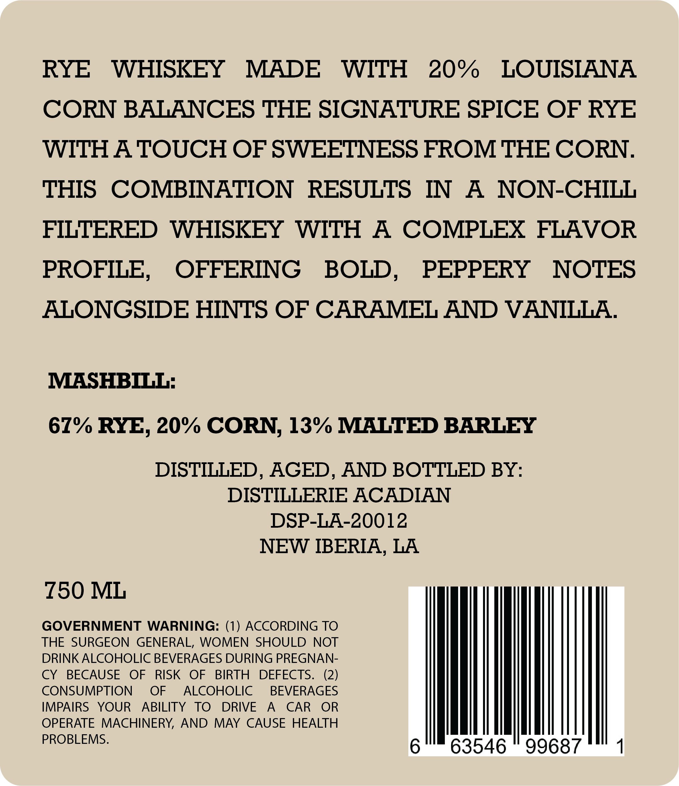
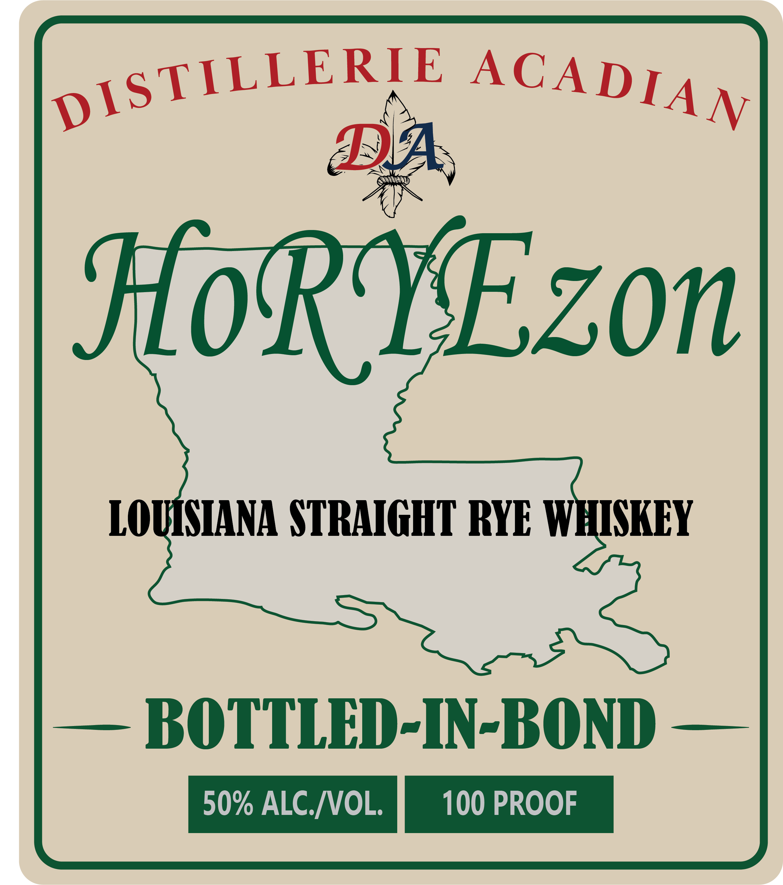
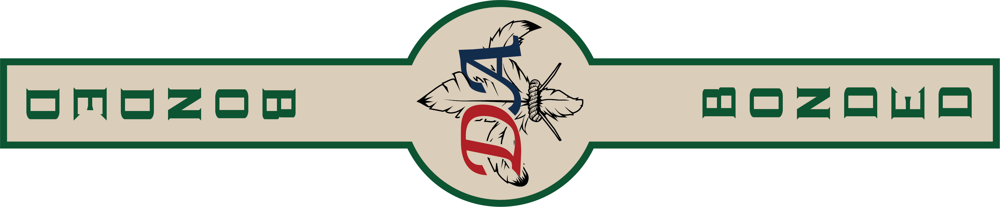

# TTB COLA Label Images - TTBID 26035001000234

**Brand Name:** DISTILLERIE ACADIAN

**Fanciful Name:** HORYEZON

**Issue Date:** 02/09/2026

**Origin Code:** 23

**Product Class/Type:** 119

**Source:** [TTB Public COLA Registry](https://ttbonline.gov/colasonline/viewColaDetails.do?action=publicFormDisplay&ttbid=26035001000234)

## Label Images

### Back Label

### Front Label

### Label 2

## Extracted Label Text

*Text extracted via OCR - may contain errors*

*1 image(s) excluded: text did not meet readability threshold*

### Back Label

RYE WHISKEY MADE WITH 20%

LOUISIANA

CORN BALANCES THE SIGNATURE SPICE OF RYE

WITH A TOUCH OF SWEETNESS FROM THE CORN.

THIS COMBINATION RESULTS IN A NON-CHILL

FILTERED WHISKEY WITH A COMPLEX FLAVOR

PROFILE, OFFERING BOLD, PEPPERY NOTES

ALONGSIDE HINTS OF CARAMEL AND VANILLA

MASHBILL:

67% RYE, 20% CORN, 13% MALTED BARLEY

DISTILLED, AGED, AND BOTTLED BY:

DISTILLERIE ACADIAN

DSP-LA-20012

NEW IBERIA, LA

£50 ML

THE SURGEON GENERAL, WOMEN SHOULD NOT

GOVERNMENT WARNING: (1) ACCORDING TO

DRINK ALCOHOLIC BEVERAGES DURING PREGNAN-

CONSUMPTION OF ALCOHOLIC BEVERAGES

CY BECAUSE OF RISK OF BIRTH DEFECTS. (2)

IMPAIRS YOUR ABILITY TO DRIVE A CAR OR

OPERATE MACHINERY, AND MAY CAUSE HEALTH

PROBLEMS.

wih)

### Front Label

piSTILLERTE ACAD 4 y.
BB.
LOR VEZON
LOUINIANA STRAIGHT RYE WHISKEY
— BOTITLED-IN-BOND —
