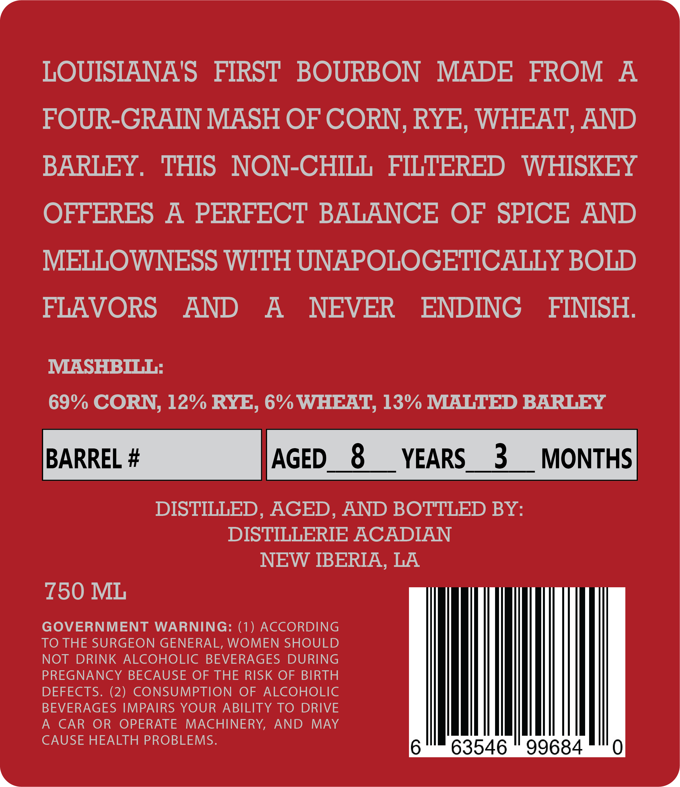
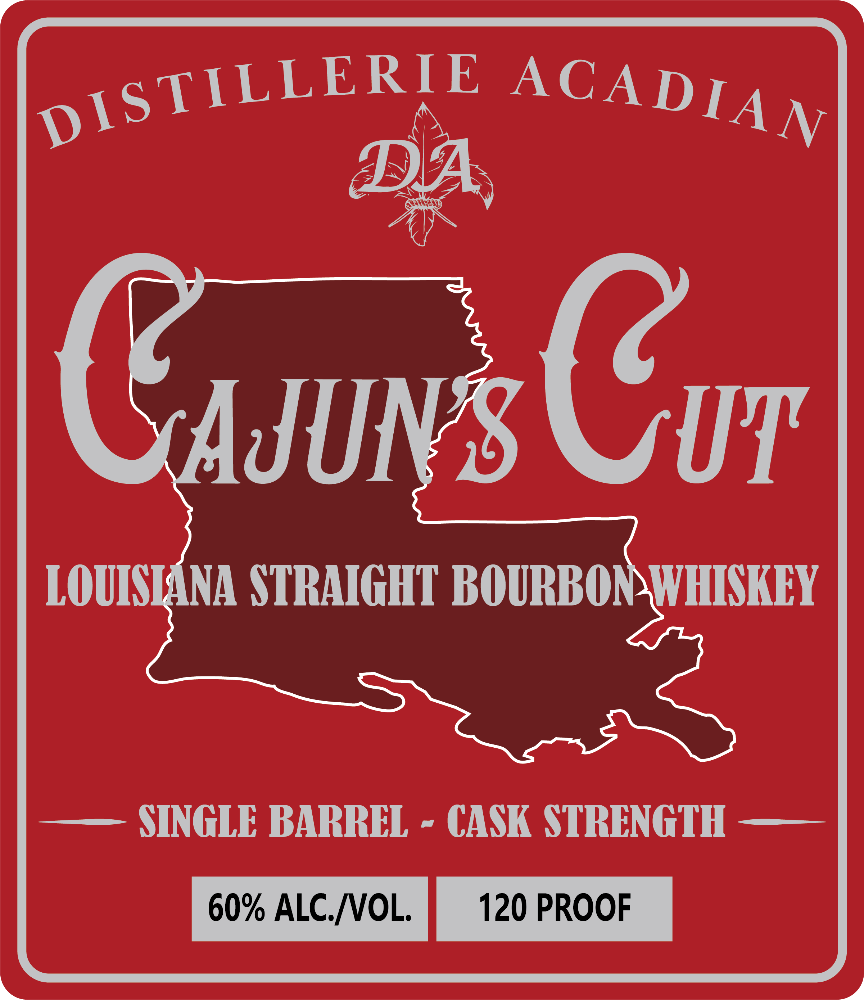
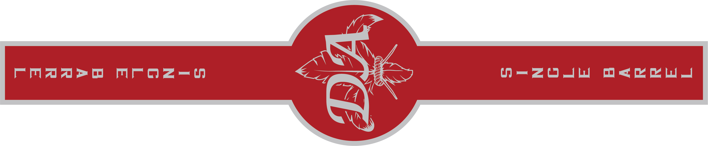

# TTB COLA Label Images - TTBID 26035001000241

**Brand Name:** DISTILLERIE ACADIAN

**Fanciful Name:** CAJUN'S CUT

**Issue Date:** 02/10/2026

**Origin Code:** 23

**Product Class/Type:** 101

**Source:** [TTB Public COLA Registry](https://ttbonline.gov/colasonline/viewColaDetails.do?action=publicFormDisplay&ttbid=26035001000241)

## Label Images

### Back Label

### Front Label

### Label 2

## Extracted Label Text

*Text extracted via OCR - may contain errors*

### Back Label

LOUISIANA'’S FIRST BOURBON MADE FROM A

FOUR-GRAIN MASH OF CORN, RYE, WHEAT, AND

BARLEY. THIS NON-CHILL FILTERED WHISKEY

OFFERES A PERFECT BALANCE OF SPICE AND

MELLOWNESS WITH UNAPOLOGETICALLY BOLD

FLAVORS AND A NEVER ENDING FINISH.

MASHBILL:

69% CORN, 12% RYE, 6% WHEAT, 13° MALTED BARLEY

Barne.# |AceD_8__vEaRs_3_MONTHS

DISTILLED, AGED, AND BOTTLED BY:

DISTILLERIE ACADIAN

NEW IBERIA, LA

£50 ML

TO THE SURGEON GENERAL, WOMEN SHOULD

GOVERNMENT WARNING: (1) ACCORDING

PREGNANCY BECAUSE OF THE RISK OF BIRTH

NOT DRINK ALCOHOLIC BEVERAGES DURING

DEFECTS. (2) CONSUMPTION OF ALCOHOLIC

A CAR OR OPERATE MACHINERY, AND MAY

BEVERAGES IMPAIRS YOUR ABILITY TO DRIVE

CAUSE HEALTH PROBLEMS.

### Front Label

iSTILLERIE ACADIAy

Cor

LOUIS

l

DWHISKEY

—— SINGLE BARREL - CASK STRENGTH ——

60% ALC.WVOL | 120 PROOF

### Label 2

M20 O<e ew

rFmMAArmD Mroz=—H

Q
