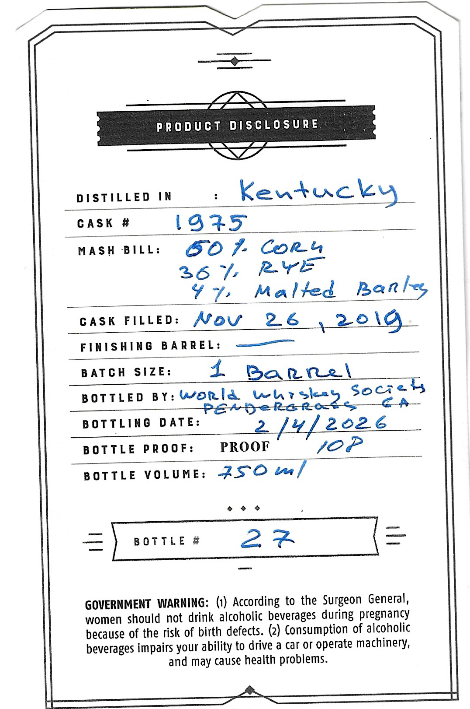
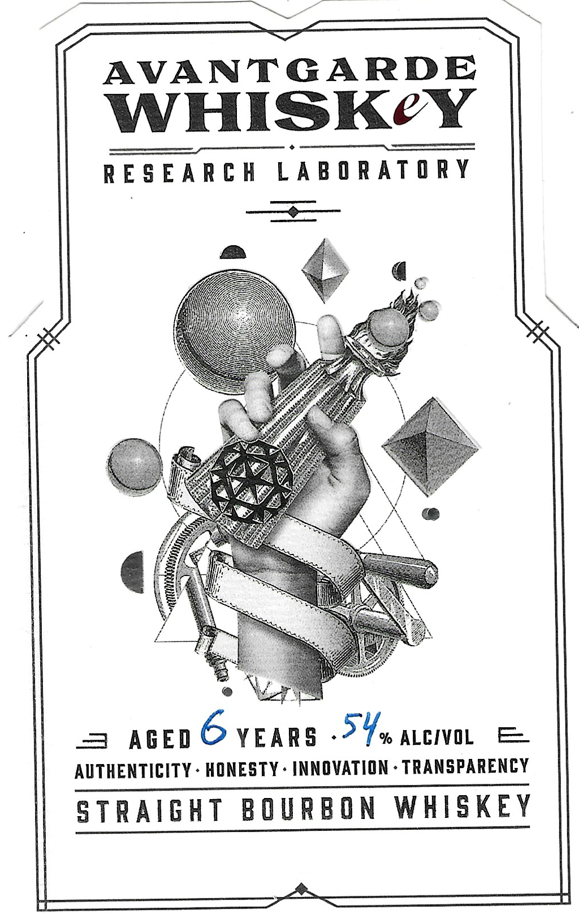

# TTB COLA Label Images - TTBID 26035001000282

**Brand Name:** AVANTGARDE

**Issue Date:** 02/12/2026

**Origin Code:** 08

**Product Class/Type:** 101

**Source:** [TTB Public COLA Registry](https://ttbonline.gov/colasonline/viewColaDetails.do?action=publicFormDisplay&ttbid=26035001000282)

## Label Images

### Back Label

### Front Label

## Extracted Label Text

*Text extracted via OCR - may contain errors*

### Back Label

i

LT MT NE

PRODUCT DISCLOSURE

a a

DISTILLED IN

Kentucky

GASK #

1925

MASH BILL:

BO 7 Cor

26% RYE

47:

Malted Be

a bee,

GASK FILLED: Afoyv 26 5 2O\0

FINISHING BARREL: ———

BATCH SIZE:

4. Barre

BOTTLED BY: WortlA Why slice Socte

is

BOTTLING DATE:

2.

2026

BOTTLE PROOF:

PROOF

JOP

BOTTLE VOLUNE: 2S°O ter/

oo 6

~

—

—_—

[aur 22

—

GOVERNMENT WARNING: (1) According to the Surgeon General,

women should not drink alcoholic beverages during pregnancy

because of the risk of birth defects. (2) Consumption of alcoholic

beverages impairs your ability to drive a car or operate machinery,

and may cause health problems.

ee SS PES FE

### Front Label

AVANTGARDE

WHISK¢Y

RESEARCH LABORATORY

"2,

Se,

)

i

q

\S

OL

1

cA \

<5

Oe. \;

\/

/N

Y

4

a

\/

=/

= AGED © YEARS oY, aceivol =

AUTHENTICITY - HONESTY - INNOVATION - TRANSPARENCY

STRAIGHT BOURBON WHISKEY
