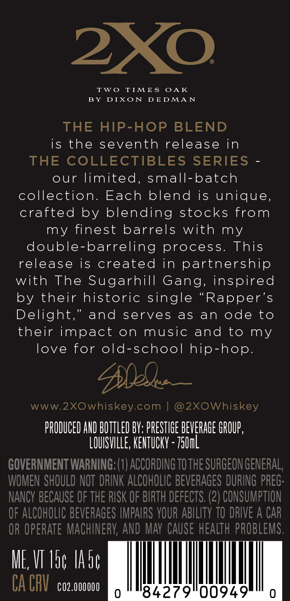
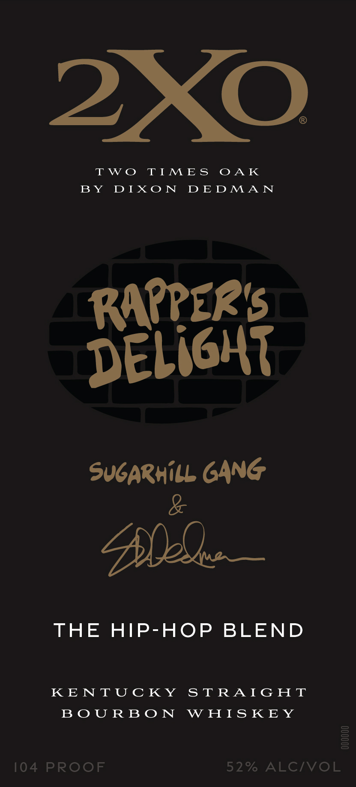

# TTB COLA Label Images - TTBID 26035001000373

**Brand Name:** 2XO

**Fanciful Name:** RAPPER'S DELIGHT

**Issue Date:** 02/11/2026

**Origin Code:** 22

**Product Class/Type:** 101

**Source:** [TTB Public COLA Registry](https://ttbonline.gov/colasonline/viewColaDetails.do?action=publicFormDisplay&ttbid=26035001000373)

## Label Images

### Back Label

### Front Label

## Extracted Label Text

*Text extracted via OCR - may contain errors*

### Back Label

2XO

BY DIXON DEDMAN

TWO TIMES OAK

THE HIP-HOP BLEND

is the seventh release in

THE COLLECTIBLES SERIES -

our limited, small-batch

collection. Each blend is unique,

crafted by blending stocks from

my finest barrels with my

double-barreling process. This

release is created in partnership

with The Sugarhill Gang, inspired

by their historic single “Rapper’s

Delight,” and serves as an ode to

their impact on music and to my

love for old-school hip-hop.

Doble

www.2XOwhiskey.com | @2XOWhiskey

PRODUCED AND BOTTLED BY: PRESTIGE BEVERAGE GROUP,

OUISVILLE, KENTUCKY ~ 750m

GOVERNMENT WARNING: (1) ACCORDING T0 THE SURGEON GENERAL

WOMEN SHOULD NO

RINK ALCOHOLIC BEVERAGES DURING PREG

NANCY BECAUSE OF THE RISK OF BIRTH DEFECTS. (2) CONSUMPTION

OF ALCOHOLIC BEVERAGES IMPAIRS YOUR ABILITY 10 DRIVE A CAR

OR OPERATE MACH

ERY, AND MAY CAUSE HEALTH PROBLEMS

ME VI Vag Ade

CA CRY 02.000

84279

00949

### Front Label

2XO

TWO TIMES OAK

BY DIXON DEDMAN

(PER'S

RA

DE

LIGHT

SUGARHILL GANG

&

Nice

THE HIP-HOP BLEND

KENTUCKY STRAIGHT

BOURBON WHISKEY

104 PROOF

52% ALC/VOL
