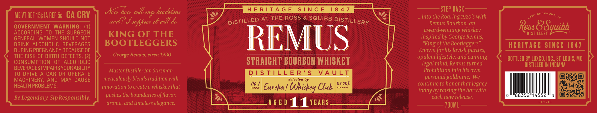

# TTB COLA Label Images - TTBID 26035001000378

**Brand Name:** REMUS

**Issue Date:** 02/09/2026

**Origin Code:** 29

**Product Class/Type:** 101

**Source:** [TTB Public COLA Registry](https://ttbonline.gov/colasonline/viewColaDetails.do?action=publicFormDisplay&ttbid=26035001000378)

## Label Images

### Label 1

### Label 2

## Extracted Label Text

*Text extracted via OCR - may contain errors*

### Label 1

GLELILELE EL gf LE a OO Oa Oa Ow BOLLE LEIA SELLE SOS OG Dg Oe oO nO eae ere
VOSS SSIES —_____—— Pesonccesnesceeseees
>  ——————————— =e
Noi how wll my headione =| gomme HERITAGE SINCE 1947 mm pee STEP BACK —
MEVTREF 5c INREFS¢ CA CRV oy. 4,4, \SY oo apTHE ROSS @ SQUIBB Dig; ,.. N42] into the Roaring1920’s with nmernin,
GOVERNMENT WARNING: (1 wad! wn seefpose a will & es igo nO ee Whigs iy pee ee = ee Remus Bourbon, an R & S$ WD
RECORDING TO THE SURGEGN Pee ol eh eee [ ) TIN MT TC! —— FE] __s award-winning whiskey Ce) g -
KING OF THE SONA Nn ALS = h Uy ees ee inspired by George Remus, PISTIETEDY
GENERAL, WOMEN SHOULD NOT NESE INST I 2 Ds Ces ee Pie ey core Hy ee
DRINK ALcoHOLC Beveraces |] BOOTLEGGERS NE VEU ing ofthe Bootteggers' HERITAGE SINCE 1847
DURING PREGNANCY BECAUSE OF - ' rer ey Soo eit Se eee Known for his lavish parties, 3.
(| He BOER Tae 2 » - George Remus, circa i STRAIGH TBOURBON WHISKEY = (eee ul ae ee « ce INC., ST. LOUIS, MO y
- ep 4 Beige Necseeees Vell ii teh Aarts guint DISTILLED IN INDIANA
MACHINERY, AND MAY CAUSE meticulously blends tradition with = Wee - Selected by : ed paces personal goldmine. We
HEALTH PROBLEMS. innovation to create a whiskey that Be mS YU MN MONON SN continue to honor that legacy
_— os the oc of, ots Bell aa A fie Late Wig today by raising the bar with
Be Legendary. Sip Responsibly. pushes the boundaries of flavor, eS AGN Tere i aa i RA CE ONG tS each new release.
aroma, andtimelesselegance. = COL) AGED | YEARS sovses-ceeecrwrney SN) 5 700ML L215
Poe mee age eee ee en, aoe __

### Label 2

ROSS & SQUIBB DISTILLERY

+

ROSS & SQUIBB DISTILLERY

+
