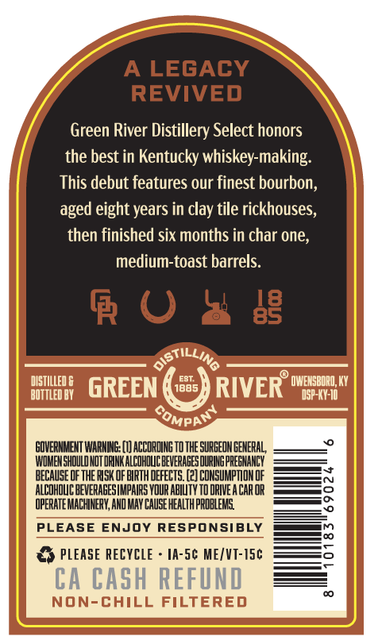
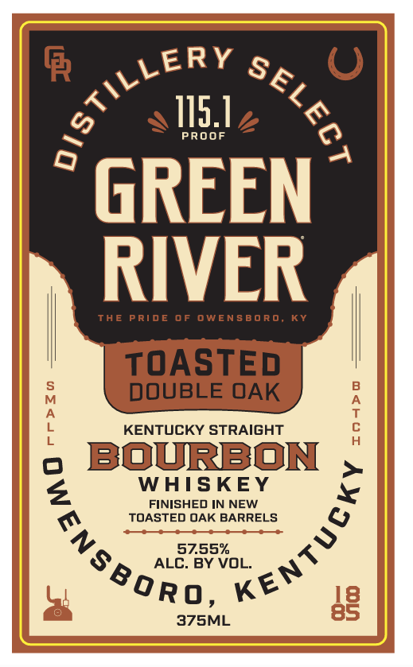
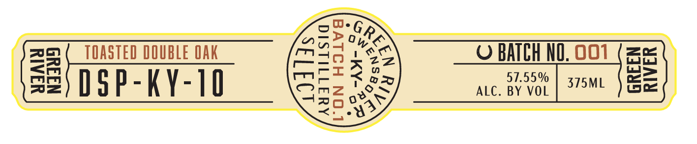

# TTB COLA Label Images - TTBID 26035001000383

**Brand Name:** GREEN RIVER

**Issue Date:** 02/10/2026

**Origin Code:** 22

**Product Class/Type:** 141

**Source:** [TTB Public COLA Registry](https://ttbonline.gov/colasonline/viewColaDetails.do?action=publicFormDisplay&ttbid=26035001000383)

## Label Images

### Back Label

### Label 1

### Label 3

## Extracted Label Text

*Text extracted via OCR - may contain errors*

### Back Label

A LEGACY

REVIVED

Green River Distillery Select honors

the best in Kentucky whiskey-making,

This debut features our finest bourbon.

aged eight years in clay tile rickhouses,

then finished six months in char one,

medium-toast barrels.

RO a

GOVERNMENT WARNINE: (1) ACCORDING TO THE SURGEON GENERAL,

‘WOMEN SHOULD NOT DRINK ALCOHOLIC BEVERAGES DURING PREGNANCY

BECAUSE DF THE RISK OF BIRTH DEFECTS. (2) CONSUMPTION OF

‘ALCOHOLIC BEVERAGES IMPAIRS YOUR ABILITY TO DRIVE A CAR OR =——s

‘OPERATE MACHINERY, AND MAY CAUSE HEALTH PROBLEMS.

PLEASE ENJOY RESPONSIBLY

OH PLEASE RECYCLE - 1A-5C ME/VT-15¢

### Label 1

a ot —
sll

THE PRIDE OF OWENSBORO, KY

TOASTED
DOUBLE OAK

KENTUCKY STRAIGHT

o BOURBON ,
WHISKEY

FINISHED IN NEW

4 é
o &

S$ ALE ay vo L. 4
®oRo, Ke™

375ML

### Label 3

we
OED ake
zor ( TOASTED DOUBLE OAK maa ver O BAICH NO. 001 (==
<m mois a= 57.55% >
ey D § P - K \- | 0 mz ky auc. BY VoL | 375M. ) See
ZO My
