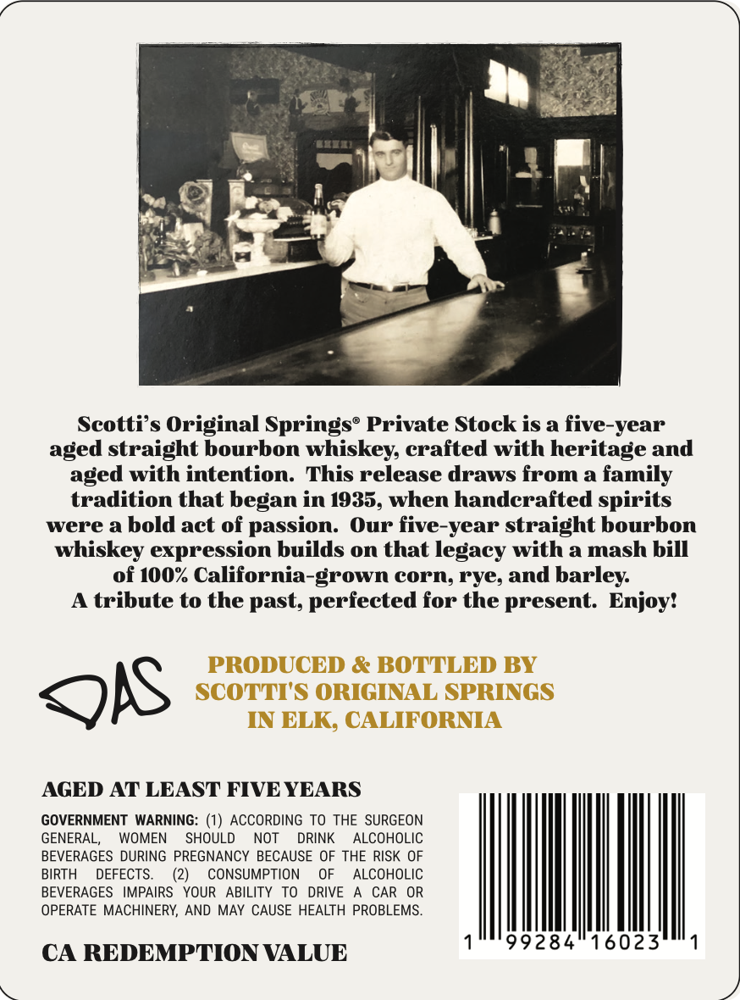
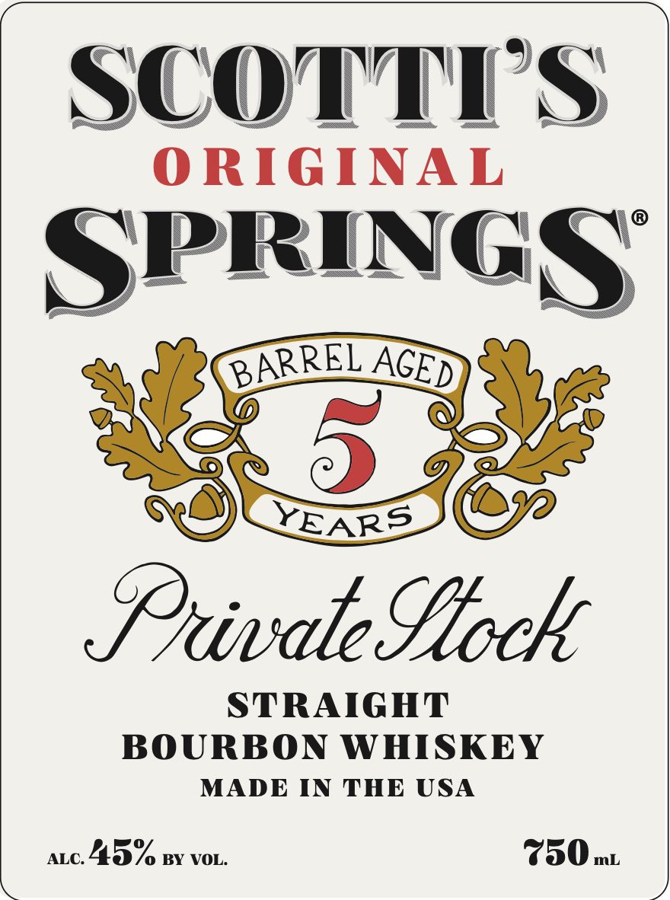

# TTB COLA Label Images - TTBID 26035001000444

**Brand Name:** SCOTTI'S ORIGINAL SPRINGS'S

**Fanciful Name:** PRIVATE STOCK

**Issue Date:** 02/09/2026

**Origin Code:** 01

**Product Class/Type:** 101

**Source:** [TTB Public COLA Registry](https://ttbonline.gov/colasonline/viewColaDetails.do?action=publicFormDisplay&ttbid=26035001000444)

## Label Images

### Back Label

### Front Label

## Extracted Label Text

*Text extracted via OCR - may contain errors*

### Back Label

Scotti’s Original Springs® Private Stock is a five-year
aged straight bourbon whiskey, crafted with heritage and
aged with intention. This release draws from a family
tradition that began in 1935, when handcrafted spirits
were a bold act of passion. Our five-year straight bourbon
whiskey expression builds on that legacy with a mash bill
of 100% California-grown corn, rye, and barley.

A tribute to the past, perfected for the present. Enjoy!

ois

AGED AT LEAST FIVE YEARS

GOVERNMENT WARNING: (1) ACCORDING TO THE SURGEON
GENERAL, WOMEN SHOULD NOT DRINK ALCOHOLIC
BEVERAGES DURING PREGNANCY BECAUSE OF THE RISK OF
BIRTH DEFECTS. (2) CONSUMPTION OF ALCOHOLIC
BEVERAGES IMPAIRS YOUR ABILITY TO DRIVE A CAR OR
OPERATE MACHINERY, AND MAY CAUSE HEALTH PROBLEMS.
1°" 99284 16023°"'1

CA REDEMPTION VALUE

/

### Front Label

SCOTTY'S
ORIGINAL

SPRINGS

Privale Loch

STRAIGHT
BOURBON WHISKEY
MADE IN THE USA

atc. 4.3% py vor. 730 m
/)
