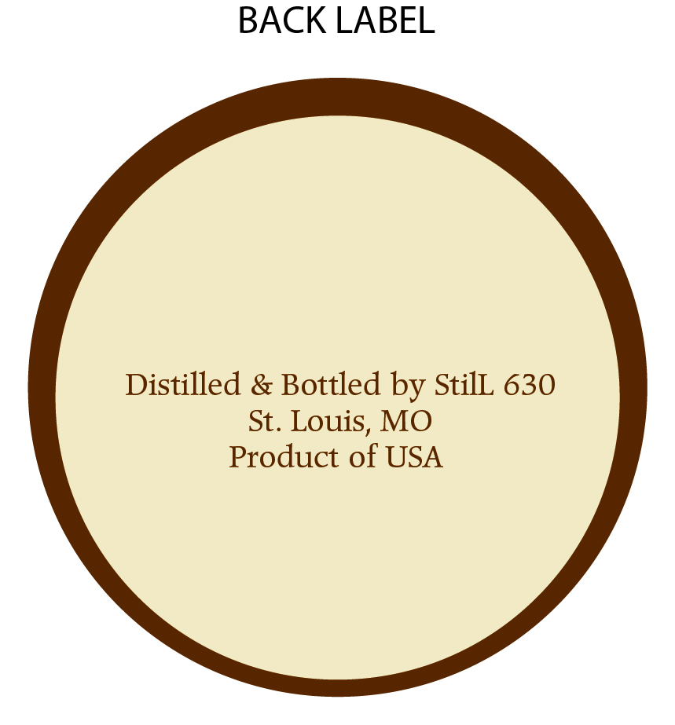

# TTB COLA Label Images - TTBID 26035001000455

**Brand Name:** ROUTE 66

**Issue Date:** 02/09/2026

**Origin Code:** 29

**Product Class/Type:** 102

**Source:** [TTB Public COLA Registry](https://ttbonline.gov/colasonline/viewColaDetails.do?action=publicFormDisplay&ttbid=26035001000455)

## Label Images

### Back Label

### Front Label

### Label 1

### Label 4

## Extracted Label Text

*Text extracted via OCR - may contain errors*

### Back Label

BACK LABEL

Distilled & Bottled by StilL 630

St. Louis, MO

Product of USA

### Front Label

FRONT LABEL

### Label 1

|

to)

GOVERNMENT WARNING: (1) ACCORDING TO THE

EPO,

ROUTE 66

x

f

SURGEON GENERAL, WOMEN SHOULD NOT DRINK

I

AFL

lt

ALCOHOLIC BEVERAGES DURING PREGNANCY

Janeen

Pai

4

Straight Rye Whiskey

CI]

BECAUSE OF THE RISK OF BIRTH DEFECTS. (2)

scan for tasty

drink recipes.

CONSUMPTION OF ALCOHOLIC BEVERAGES IMPARIS

Ni La

YOUR ABILITY 10 DRIVE A CAR OR OPERATE

66 81755".

(90 Proof) 45% Alc/Vol 750ml

still630.com

MACHINERY, AND MMAY CAUSE HEALTH PROBLEMS:

### Label 4

TOP SEAL LABEL

ap

a
