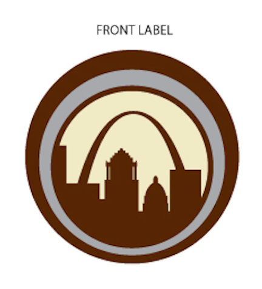

# TTB COLA Label Images - TTBID 26035001000459

**Brand Name:** MOTHER ROAD

**Issue Date:** 02/09/2026

**Origin Code:** 29

**Product Class/Type:** 102

**Source:** [TTB Public COLA Registry](https://ttbonline.gov/colasonline/viewColaDetails.do?action=publicFormDisplay&ttbid=26035001000459)

## Label Images

### Back Label

### Front Label

### Label 1

### Label 4

## Extracted Label Text

*Text extracted via OCR - may contain errors*

*2 image(s) excluded: text did not meet readability threshold*

### Back Label

BACK LABEL

Distilled & Bottled by StilL 630

St. Louis, MO

Product of USA

### Label 1

MOTHER ROAD

Straight Rye Whiskey

(90 Proof) 45% Alc/Vol 750ml

Base
tf
&
scan for tasty
drink recipes.
still630.com

GOVERNMENT WARNING: (1) ACCORDING TO THE
SURGEON GENERAL, WOMEN SHOULD NOT DRINK
ALCOHOLIC BEVERAGES DURING PREGNANCY
BECAUSE OF THE RISK OF BIRTH DEFECTS. (2)
CONSUMPTION OF ALCOHOLIC BEVERAGES IMPARIS
YOUR ABILITY 10 DRIVE A CAR OR OPERATE
MACHINERY, AND MMAY CAUSE HEALTH PROBLEMS.

Mea I

aaa

59661817554
