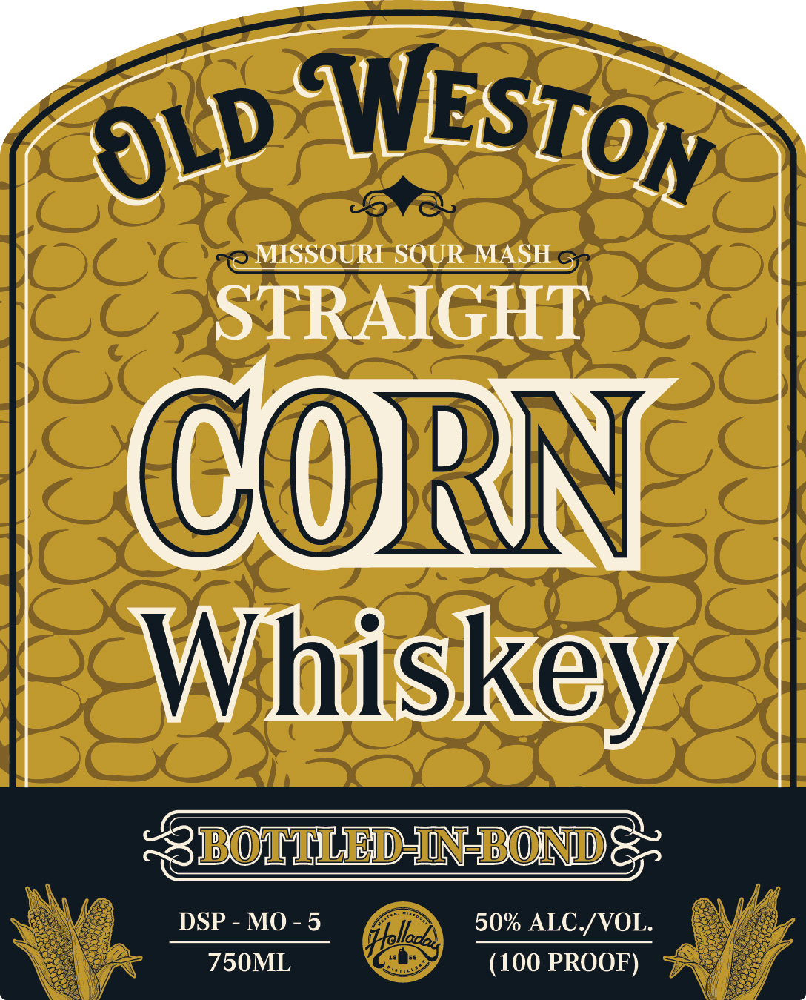
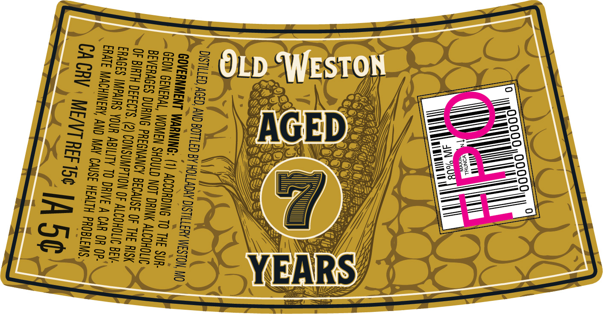

# TTB COLA Label Images - TTBID 26035001000465

**Brand Name:** OLD WESTON

**Issue Date:** 02/17/2026

**Origin Code:** 29

**Product Class/Type:** 113

**Source:** [TTB Public COLA Registry](https://ttbonline.gov/colasonline/viewColaDetails.do?action=publicFormDisplay&ttbid=26035001000465)

## Label Images

### Label 1

### Label 2

## Extracted Label Text

*Text extracted via OCR - may contain errors*

### Label 1

| gy “WEST¢ ik

STRAIGHT

CORN

Wihiskey,

eae

M.

(

/

)

### Label 2

——

—

t= ye ——s

Ss

_—

<—

SS

——

S2Qa

a

y |

==

a ——)

Waa ian eon

De

~

oF

=o

feel SS)

S25

be

oa

Gp Ss

>=

FeoD

=>

mo

Ssou= =

sm

Wy

——

y=?

c—J

CBs¥

fh

=

aon SS]

a=

2

e.

Se

C\

l

SS =>S

=D

——

a

aoa =

=S.8

D

2=D

=> &

==

A

G

=

Sas FS

Cy

\\

\e

Dp

==

Se > —

Se—.2e2

Ros,

aes SS

Ss

(hod

bo fl

Smw=SB

SN

: |

==

a 8

= 5

=S3S

S/L2-

«4

LS

=m

7  & &

eo

=o

= >

9

3s

=> Oem

=

&f

oa

SSS os

Ssoaox4

F=zo3

. F

m=

aS

ar

i,

if

Eom

SH a

— =—*

a.

,

\

lt it al

y]

y

Lod

——

——

yi

NS

A

R

LY

S

oe

—

ee

i

ee ames ca a ESS Se

Sa
