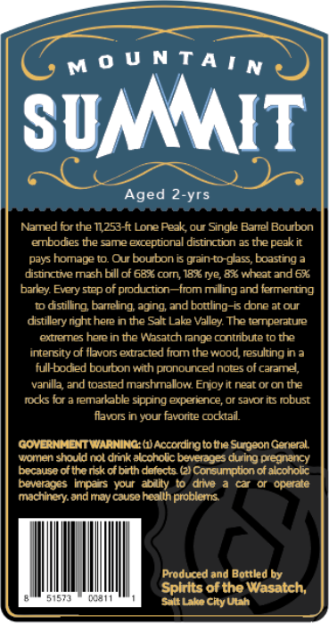
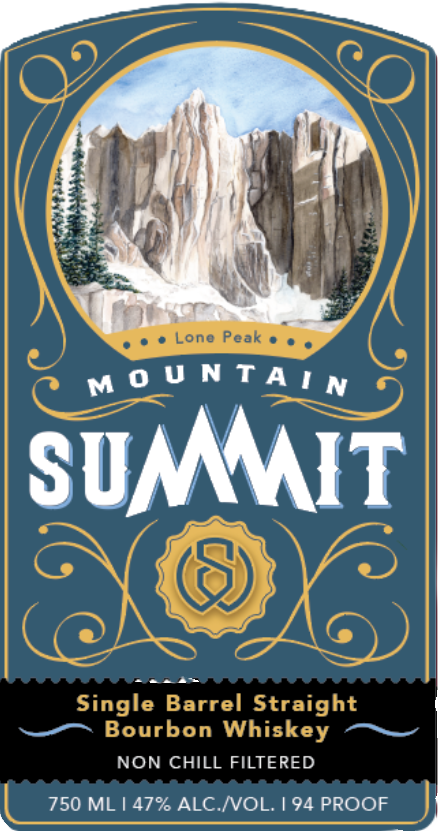
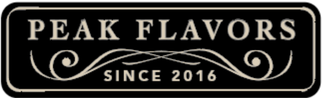

# TTB COLA Label Images - TTBID 26035001000481

**Brand Name:** MOUNTAIN SUMMIT

**Issue Date:** 02/09/2026

**Origin Code:** 45

**Product Class/Type:** 101

**Source:** [TTB Public COLA Registry](https://ttbonline.gov/colasonline/viewColaDetails.do?action=publicFormDisplay&ttbid=26035001000481)

## Label Images

### Back Label

### Front Label

### Label 3

## Extracted Label Text

*Text extracted via OCR - may contain errors*

*1 image(s) excluded: text did not meet readability threshold*

### Back Label

MOUNTATY

SUMMIT

Aged 2-yrs

Named for the T253-ft Lone Peak, our Single Barral Bourbon

embodees the same exceptional distinction as the peak it

pays homage to. Our bourbon is grain-to-glass, boasting a

distinctive mash bill of 68% corn, 18% rye, 8% wheat and 6%

barley. Every step of production—from milling and ferment

1p distiing, baraling, aging, and bottling-is done at our

distilory ight here in the Salt Lake Valley. The tarnperature

‘@aremes hare in the Wasatch range contribute to the

intensity of flavors extracted from the wood, resulting in a

fulHbodied bourbon with pronounced notes of caramel,

vanilla, and toasted marshmallow. Enjoy it neat or on the

rocks for a remarkable sipping experience, or savor its robust

flavors in your favorite cocktail

GOVERNMENT WARNING: () According tothe Surgeon General.

women shou ca nk lehole bavrages an Bree

because ofthe risk of bith defects (2! Consumption of

tovwayes inpars your ate 34 Aa) ea oP Ora

machinery. and may cause health problems,

Produced and Bottled by

Spirits of the Wasatch,

Salt Lake City Utah

### Front Label

MOUNTAIYyN

SUMMIT

NON CHILL FILTERED

750 ML | 47% ALC./VOL. | 94 PROOF
