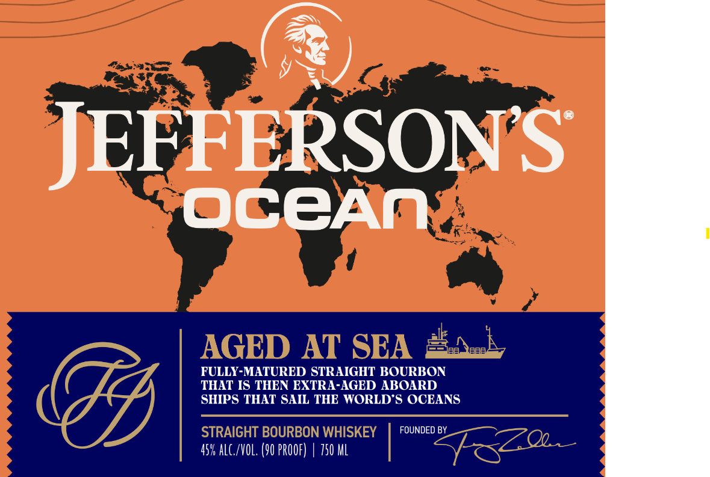
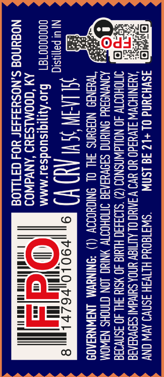

# TTB COLA Label Images - TTBID 26035001000576

**Brand Name:** JEFFERSON'S

**Issue Date:** 02/24/2026

**Origin Code:** 12

**Product Class/Type:** 101

**Source:** [TTB Public COLA Registry](https://ttbonline.gov/colasonline/viewColaDetails.do?action=publicFormDisplay&ttbid=26035001000576)

## Label Images

### Front Label

### Label 2

### Label 3

### Label 4

## Extracted Label Text

*Text extracted via OCR - may contain errors*

*1 image(s) excluded: text did not meet readability threshold*

### Front Label

(@)

FERSONS

JEE

OCeAN

FULLY-MATURED STRAIGHT BOURBON

THAT IS THEN EXTRA-AGED ABOARD

SHIPS THAT SAIL THE WORLD'S OCEANS

FOUNDED BY

45% ALC/VOL. (90 PROOF) | 750 ML

### Label 2

ASWHIUNd OL+L2 3G 1SNW = “SW3T80Yd HITVIH ISNVI AV ONY
‘ANANTH JLVUad0 YO UV V AHO OL ALTIGV UNDA SUIvdWI| SANVAAIE
SMOHOTTY 40 NOIAWNSNOS (2) °SL93430 HIMIG 40 ¥SIY 3HL 40 3Snv93a
AONYNSAUd SNIUNG SI9VHINIG INIOHOTTY NING LON CINCHS NAWOM
“WHANGS NOJOUNS 3HL OL INIGHOIIV (1) *ININYVM LNAWNYAAOS

NIU pamnsig Ml Lien i Hl NG ) ©

oooov0d1e1 © B0"Ayijiqisuodsas-mmm
AM ‘GOOMLS3U9 ‘ANVAWO
NO@unod S.NOSH3449F YO4 GALLO

### Label 4

AAAS AASAASASASNASAS SSNS SSS SS SESS SS
Of. O|
Bian
Fa, a
meee
obs
AAA AAA AAAS AAAS ASS A  T S >>
De
