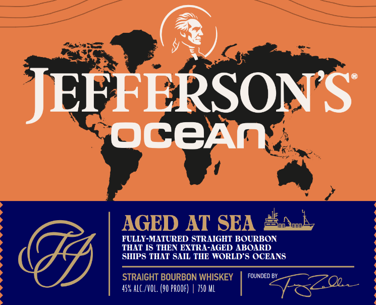
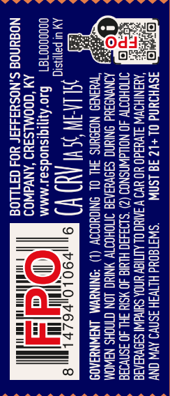

# TTB COLA Label Images - TTBID 26035001000591

**Brand Name:** JEFFERSON'S

**Issue Date:** 02/24/2026

**Origin Code:** 12

**Product Class/Type:** 101

**Source:** [TTB Public COLA Registry](https://ttbonline.gov/colasonline/viewColaDetails.do?action=publicFormDisplay&ttbid=26035001000591)

## Label Images

### Front Label

### Label 2

### Label 3

### Label 4

## Extracted Label Text

*Text extracted via OCR - may contain errors*

### Front Label

(2)

PERSONS

JEE

OCeAN

THAT IS THEN EXTRA-AGED ABOARD

FULLY-MATURED STRAIGHT BOURBON

SHIPS THAT SAIL THE WORLD'S OCEANS

FOUNDED BY

45% ALC/VOL. (90 PROOF) | 750 ML

### Label 2

ss

se

Bs

ray

Ss

ss

EE

batt

Ee

aa

n>

a

Z<a

2362

525

SH Pas

aac

aS

Sse

eats

S83

gs

esp

So

ees

ss

So

ene

BB

an

2o8

Sea

Ssu

a

=a

eo5_

ee

Zea

i)

Pesss

s2z=cm

sGa2

VSaaa

mos

Bon

382

Se3Su

=82a

ea

LO

e2a

Qe

25635

geeex

=O

=

25550

2e=

WER

=~

ste

FS

et

Za

Saco

—=._

ea

g=

BEas

### Label 4

SSAA SSSA EOD

=

—

Ola

or

m

Fy

OCEAN }}/ VOYAGE

ol

be

SSA SAAT
