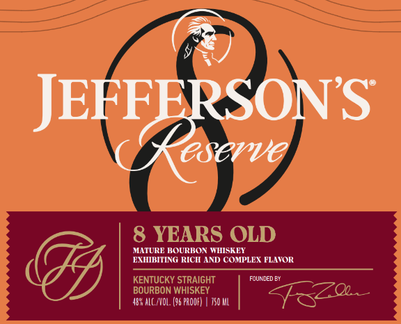
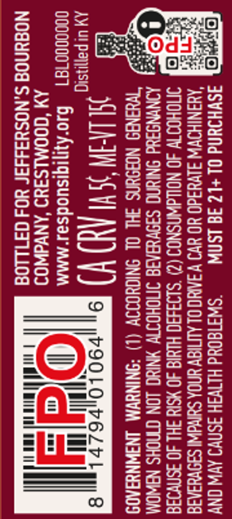

# TTB COLA Label Images - TTBID 26035001000614

**Brand Name:** JEFFERSON'S

**Issue Date:** 02/09/2026

**Origin Code:** 22

**Product Class/Type:** 101

**Source:** [TTB Public COLA Registry](https://ttbonline.gov/colasonline/viewColaDetails.do?action=publicFormDisplay&ttbid=26035001000614)

## Label Images

### Front Label

### Label 2

### Label 3

## Extracted Label Text

*Text extracted via OCR - may contain errors*

### Front Label

=

2SON'S

JEF

CSUVVE

MATURE BOURBON WHIS

EY

EXHIBITING RICH AND COMPLEX FLAVOR

FOUNDED EY

485 ALC/VOL. (96 PROOF) | 750 ML

### Label 3

o>

eo

i)

ea

eH

fe a]

ot

SsS=

Cit {Oo}

ogt

dO}

on

pa fo]

onw

23

ous

8a

as

=e

eco

=

n#t§ =>

oSowo

Lu

Ww2

cc

se

oo

an

>a

Sa5

SzS

oe

2or

aw

4

Sow

isn

essa

o=

25

=

(S)

Ss

=O

— hs

S535

==o

—l

ss

==

—r

a

=n@—

G2eu

a4se

Bs5

ao=
