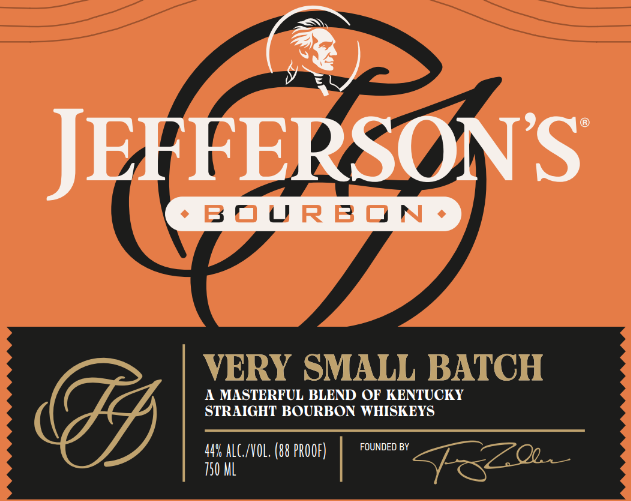
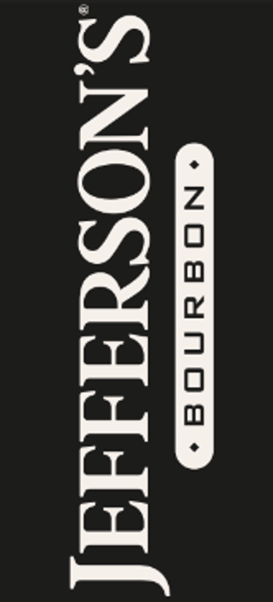
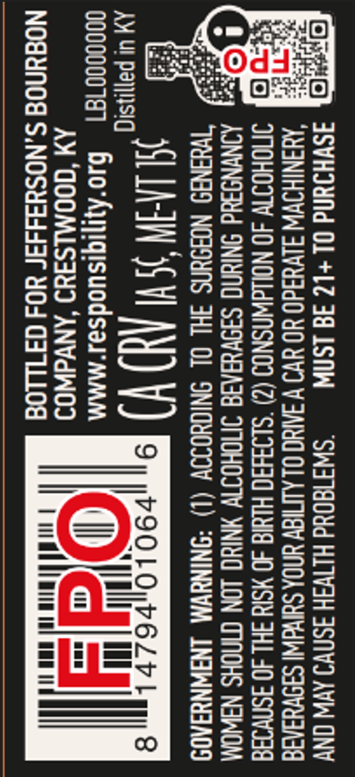

# TTB COLA Label Images - TTBID 26035001000636

**Brand Name:** JEFFERSON'S

**Issue Date:** 02/10/2026

**Origin Code:** 22

**Product Class/Type:** 121

**Source:** [TTB Public COLA Registry](https://ttbonline.gov/colasonline/viewColaDetails.do?action=publicFormDisplay&ttbid=26035001000636)

## Label Images

### Front Label

### Label 2

### Label 3

## Extracted Label Text

*Text extracted via OCR - may contain errors*

### Front Label

(®)

JEFFERSON’S

STRAIGHT BOURBON WHISKEYS

A MASTERFUL BLEND OF KENTUCKY

FOUNDED BY

44 ALC/VOL, (88 PROOF)

### Label 2

oe}:

Qt

ME

Cl ff

### Label 3

o>

Ssé=

Ce)

s:= fe

=e

— ee}

— =

=s

n>

a)

> hu

2

Suis

za

=Zzx

as

— o

o>

o>

=c

Ww

=s

-~S2S>

Sows

Tw

ecc

= 3

S6E

so

[Ea

ovusc

S— Fue eceo

wae

a2

——_

255

jo F68as

zac

"Sua

en

an

© Beers

(—3= 5 —4

oz

s=

sea

ect

==

—s—)

S555

=Ss

=

(= =

Bun

Wat

i)

a

=

—

a

—r

=anoew

a

s=

oo
