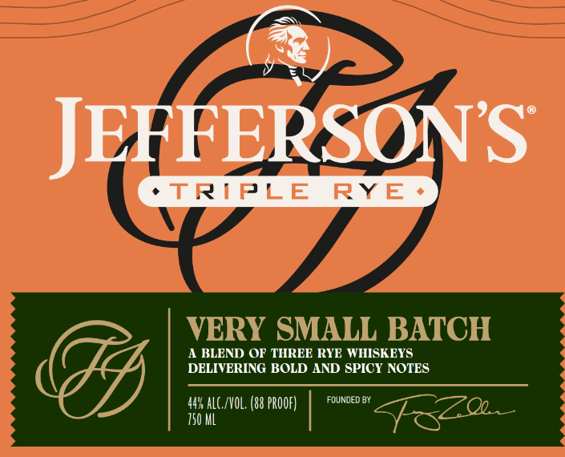
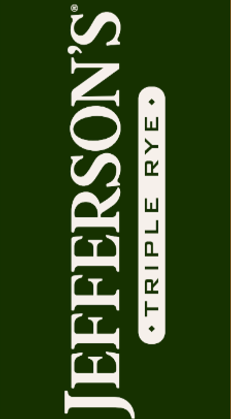
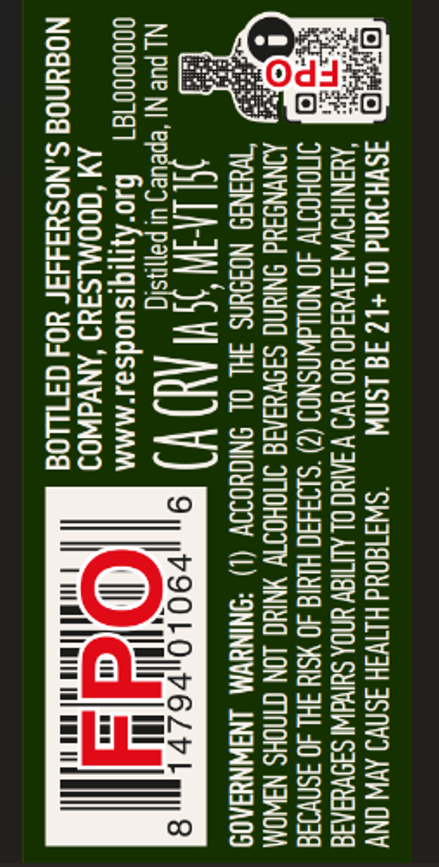

# TTB COLA Label Images - TTBID 26035001000655

**Brand Name:** JEFFERSON'S

**Issue Date:** 02/11/2026

**Origin Code:** 22

**Product Class/Type:** 122

**Source:** [TTB Public COLA Registry](https://ttbonline.gov/colasonline/viewColaDetails.do?action=publicFormDisplay&ttbid=26035001000655)

## Label Images

### Front Label

### Label 2

### Label 3

## Extracted Label Text

*Text extracted via OCR - may contain errors*

*1 image(s) excluded: text did not meet readability threshold*

### Front Label

(®)

JEFFERSON'S

A BLEND OF THREE RYE WHISKEYS

DELIVERING BOLD AND SPICY NOTES

aM

/NOL. (88 PROOF)

FOUNDED BY

### Label 3

ASWHIUNd OL+L2 FG 1SNW = “SWI1804d HITVIH 3SNV9 AVW ONY
‘ANINIHOWW J1VUAd0 YO UV WAAC OL ALITIAV UNDA SUIvdWNI SI9VeAAIE
SMOHOOTV 40 NOLLdWNSNOS (2) °$193430 HIYIG 40 ¥SId HL 40 ISNvI3a
AONYNSSYd ONIN S39VYIAIA INOHOTTY NIN LON CINOHS NSWOM
“Weanad NOagUnS FHL OL SNIGHOIOV (1) “ONINYVM LNSWNYIAOS

NL pe NI‘ miele 2 aM Kt) Y) 9

goo00001g1 +0"! fsuodzat MMM

AM ‘GOOMLSIYD ‘ANVdWOI
NO@uNOd S.NOSH3II3F YO4s CF 1LLOd
