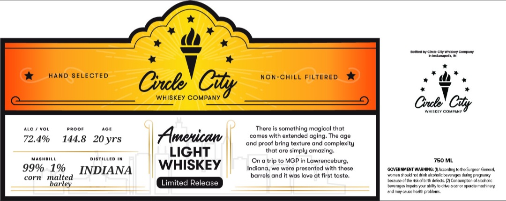

# TTB COLA Label Images - TTBID 26036001000038

**Brand Name:** CIRCLE CITY WHISKEY COMPANY

**Issue Date:** 02/11/2026

**Origin Code:** 19

**Product Class/Type:** 144

**Source:** [TTB Public COLA Registry](https://ttbonline.gov/colasonline/viewColaDetails.do?action=publicFormDisplay&ttbid=26036001000038)

## Label Images

### Label 1

## Extracted Label Text

*Text extracted via OCR - may contain errors*

### Label 1

‘ores cc waa company

‘mina

*

NON-CHILL FILTERED

mw)

HAND SELECTED Crete

WHISKEY COMPANY

Cy

J

Cots

wniakty cow

Cily

m

Ave / vor

pRoor

aor

There is something magical that

‘comes with extended aging. The age

72.4%

144.8 20yrs

and proof bring texture and complexity

|

|

that are simply amazing.

MasHBILE

pisTiLLED Im

LIGHT

(On a trip to MGP in Lawrenceburg,

750 ML

99% 1%

WHISKEY

Indiana, we were presented with these

Sugeon Goer

corn malte

4 INDIANA

barrels and it was love at first taste.

an

GOVERNMENT WARING cao

mt dikalechae bn

sg renty

arley

iM

tee

ike th dls 2

lon foal

—

=

nd nay cure he proba,

2995p yar by tod car of operat machine,
