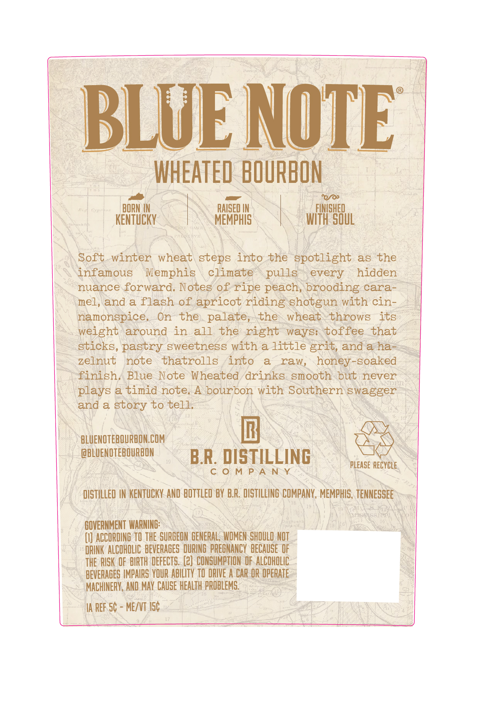
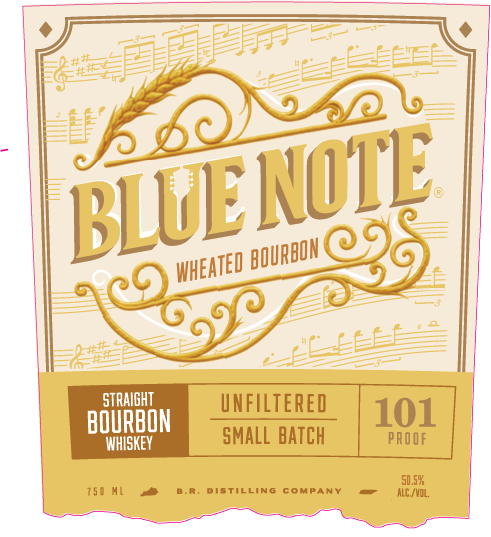

# TTB COLA Label Images - TTBID 26036001000080

**Brand Name:** BLUE NOTE

**Fanciful Name:** WHEATED BOURBON 101

**Issue Date:** 02/11/2026

**Origin Code:** 43

**Product Class/Type:** 101

**Source:** [TTB Public COLA Registry](https://ttbonline.gov/colasonline/viewColaDetails.do?action=publicFormDisplay&ttbid=26036001000080)

## Label Images

### Back Label

### Front Label

### Label 2

## Extracted Label Text

*Text extracted via OCR - may contain errors*

*1 image(s) excluded: text did not meet readability threshold*

### Back Label

: BLUE NOTE
HEATED BOURBON
OR, ed ecto IRORIIN EA N RAISED IN. Yt i fuse On
KENTUCKY | SOMEMPHISS. WITH SOUL
.\Soft-winter wheat steps into the spotlight as the
\SNingamous “Memphis \ cyimate\ pulig every hidden _
». nuance forward. Notes of ripe peach, brooding cara-.)
-\mel, and a flash of apricot riding shotgun with'cin- z
\. Mamonspice, On the. palate; the. wheat\throws its
-\ weight around in all the right ways: toffee that
_ sticks, pastry sweetness with a little erit, anda has
= zelnut note thatrolls into a raw, honey soaked
_ ‘finish, Blue Note Wheated drinks smooth but never ~
\ plays a timid note, A bourbon with Southern swagger
gag a BtBey Hoteles: | /5/)\ Vn AD
- BLUENOTEBOURBON.COM J. Ne Ba
/ (OBLUENOTEBOURBON ~~ eTH TING. | SOO
ea he BR. DISTILLING “PLEASE RECYCLE, |
|| DISTILLED IN KENTUCKY. AND BOTTLED BY B.R. DISTILING COMPANY, MEMPHIS, TENNESSEE
ie Nase 1 AA Baas SDS SAG eee ee h eae ey
Pr UNO Dt ee Wes ey WANN oT). BE) anea\ssime) \ Avi
‘GOVERNMENT WARNING! SN SIE AC ENS NY
/ (I) ACCORDING T0 THE SURGEON GENERAL, WOMEN SHOULD NOT - AY
~ DRINK ALCOHOLIC: BEVERAGES DURING PREGNANCY BECAUSE OF ey
_ THE RISK OF BIRTH DEFECTS. (2) CONSUMPTION OF: ALCOHOLIC: - &
“BEVERAGES IMPAIRS YOUR ABILITY TO DRIVE A CAR OR OPERATE = =<
~~ NACHINERY, AND MAY CAUSE HEALTH PROBLEMS. fe
“AREESC - ME/VT IS =| SREP WN Na
eae Ny eA LA ONE

### Front Label

MOTE

BLUE

eared oe, 9

STRAIGHT

UNFILTERED

WHISKEY

SMALL BATCH

TSU HL a

DISTILLING COMPANY

SISK
