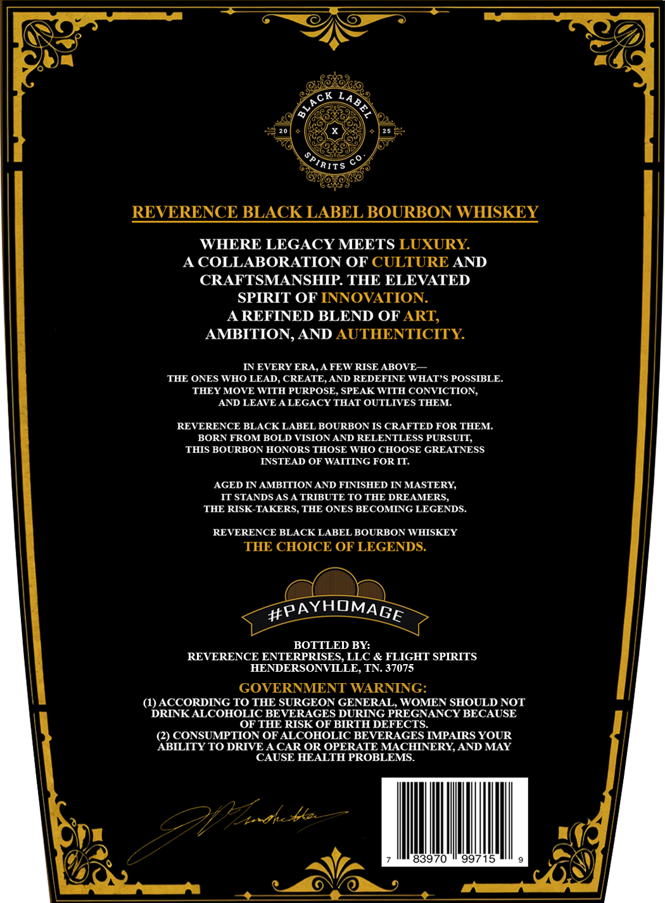

# TTB COLA Label Images - TTBID 26036001000111

**Brand Name:** BLACK LABEL

**Issue Date:** 02/13/2026

**Origin Code:** 43

**Product Class/Type:** 101

**Source:** [TTB Public COLA Registry](https://ttbonline.gov/colasonline/viewColaDetails.do?action=publicFormDisplay&ttbid=26036001000111)

## Label Images

### Front Label

## Extracted Label Text

*Text extracted via OCR - may contain errors*

### Front Label

REVERENCE BLACK LABEL BOURBON WHISKEY

WHERE LEGACY MEETS LUXURY.

A COLLABORATION OF CULTURE AND
CRAFTSMANSHIP. THE ELEVATED
SPIRIT OF INNOVATION.

A REFINED BLEND OF ART,
AMBITION, AND AUTHENTICITY.

IN EVERY ERA, A FEW RISE ABOVE—
THE ONES WHO LEAD, CREATE, AND REDEFINE WHAT’S POSSIBLE.
THEY MOVE WITH PURPOSE, SPEAK WITH CONVICTION,
AND LEAVE A LEGACY THAT OUTLIVES THEM.

REVERENCE BLACK LABEL BOURBON IS CRAFTED FOR THEM.
BORN FROM BOLD VISION AND RELENTLESS PURSUIT,
THIS BOURBON HONORS THOSE WHO CHOOSE GREATNESS
INSTEAD OF WAITING FOR IT.

AGED IN AMBITION AND FINISHED IN MASTERY,
IT STANDS AS A TRIBUTE TO THE DREAMERS,
THE RISK-TAKERS, THE ONES BECOMING LEGENDS.

REVERENCE BLACK LABEL BOURBON WHISKEY
THE CHOICE OF LEGENDS.

BOTTLED BY:
REVERENCE ENTERPRISES, LLC & FLIGHT SPIRITS
HENDERSONVILLE, TN. 37075

GOVERNMENT WARNING:

(1) ACCORDING TO THE SURGEON GENERAL, WOMEN SHOULD NOT
DRINK ALCOHOLIC BEVERAGES DURING PREGNANCY BECAUSE
OF THE RISK OF BIRTH DEFECTS.

(2) CONSUMPTION OF ALCOHOLIC BEVERAGES IMPAIRS YOUR
ABILITY TO DRIVE A CAR OR OPERATE MACHINERY, AND MAY

CAUSE HEALTH PROBLEMS.

4

83970 © 99715
