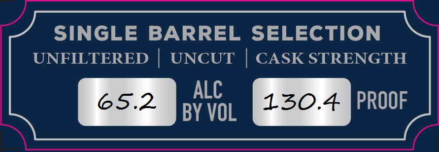
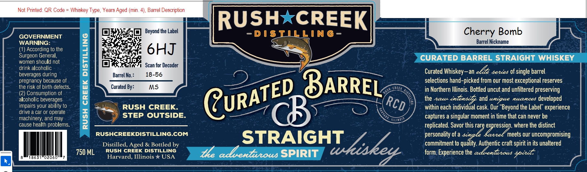
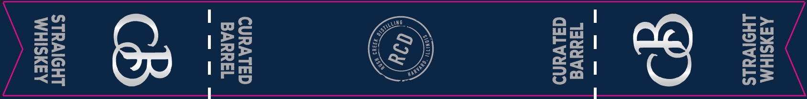

# TTB COLA Label Images - TTBID 26036001000118

**Brand Name:** RUSH CREEK DISTILLING

**Issue Date:** 02/13/2026

**Origin Code:** 04

**Product Class/Type:** 100

**Source:** [TTB Public COLA Registry](https://ttbonline.gov/colasonline/viewColaDetails.do?action=publicFormDisplay&ttbid=26036001000118)

## Label Images

### Label 1

### Label 2

### Label 3

## Extracted Label Text

*Text extracted via OCR - may contain errors*

### Label 1

SINGLE BARREL SELECTION

UNFILTERED | UNCUT | CASK STRENGTH

ALC

ca.

Y VOL

PROOF

### Label 2

GOVERNMENT
WARNING:

(4) According to the
Surgeon General,
women should not
drink alcoholic
beverages during
pregnancy because of

the risk of birth defects.

(2) Consumption of
alcoholic beverages
impairs your ability to
drive a car or operate
machinery, and may

cause health problems.

| Dill |

RUSH CREEK DISTILLING

750 ML

RUSHCREEKDISTILLING.COM

RUSH

Ob ea Beyond the Label -D1Is

SEESE OL

Scan for Decoder
1

RUSH CREEK.
STEP OUTSIDE.

Distilled, Aged & Bottled by
RUSH CREEK DISTILLING
Harvard, Illinois * USA

*xCREEK

LING-—

STRAIGHT

SPIRIT

erry B
Barrel Nickname

CURATED BARREL STRAIGHT WHISKEY

Curated Whiskey—an be 4ecces Of single barrel
selections hand-picked from our most exceptional reserves

in Northern Illinois. Bottled uncut and unfiltered preserving

the 2c < ly al encgue nuances developed
within each individual cask. Our “Beyond the Label” experience
captures a singular moment in time that can never be
replicated. Savor this rare Vig de where the distinct

personality of a ee meets our uncompromising
commitment to quality. Authentic craft spirit in its unaltered

form. Experience the aL entree gocrle

### Label 3

AZXSIHM
LHOIVaLS

1addve
dalvand

STE)
D
‘A

AS
a

Ss
S
ww

CURATED
BARREL

STRAIGHT
WHISKEY
