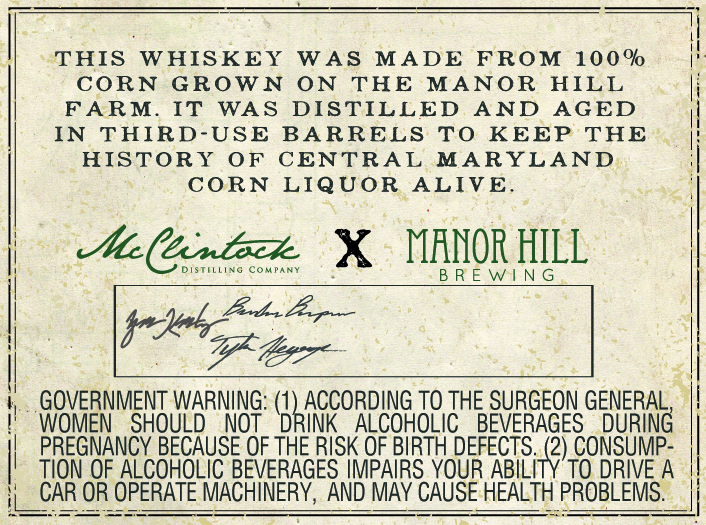

# TTB COLA Label Images - TTBID 26036001000144

**Brand Name:** ESTATE GROWN

**Issue Date:** 02/09/2026

**Origin Code:** 25

**Product Class/Type:** 143

**Source:** [TTB Public COLA Registry](https://ttbonline.gov/colasonline/viewColaDetails.do?action=publicFormDisplay&ttbid=26036001000144)

## Label Images

### Front Label

## Extracted Label Text

*Text extracted via OCR - may contain errors*

### Front Label

]

: i
THIS WHISKEY WAS MADE FROM 100% |
CORN GROWN ON THE MANOR HILL i
FARM. IT WAS DISTILLED AND AGED
IN THIRD-USE BARRELS TO KEEP THE
HISTORY OF CENTRAL MARYLAND

CORN LIQUOR ALIVE.

Aa Cantoce. X VOR HILL

DISTHLLING CoMPAN

bei

GOVERNMENT WARNING: (1 yon TO THE SURGEON GENERAL, |!
"WOMEN SHOULD NOT DRINK ALCOHOLIC BEVERAGES DURING
PREGNANCY BECAUSE OF THE RISK OF BIRTH DEFECT: ea) CONSUMP-
TION OF ALCOHOLIC BEVERAGES IMPAIRS YOUR ABILITY TO DRIVE A
_CAR OR OPERATE MACHINERY, AND MAY CAUSE HEALTH | PROBLEMS.
