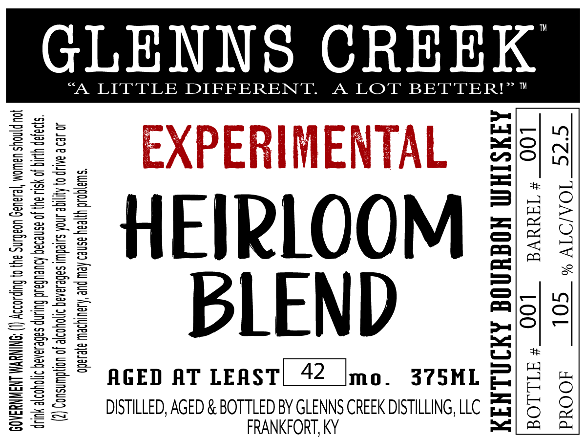

# TTB COLA Label Images - TTBID 26036001000154

**Brand Name:** GLENNS CREEK

**Fanciful Name:** EXPERIMENTAL HEIRLOOM BLEND

**Issue Date:** 02/09/2026

**Origin Code:** 22

**Product Class/Type:** 141

**Source:** [TTB Public COLA Registry](https://ttbonline.gov/colasonline/viewColaDetails.do?action=publicFormDisplay&ttbid=26036001000154)

## Label Images

### Back Label

## Extracted Label Text

*Text extracted via OCR - may contain errors*

### Back Label

GLENNS CREEK

“A LITTLE DIFFERENT. A LOT BETTER!”®™

c=

ao

ne |\O

Fated | —

na\O

HEIRLOOM

&

BLEND

ca

Ss

AGED AT LEAST|_42_ Imo. 375ML—

wT

DISTILLED, AGED & BOTTLED BY GLENNS CREEK DISTILLING, LLC. fa

ot

FRANKFORT, KY
