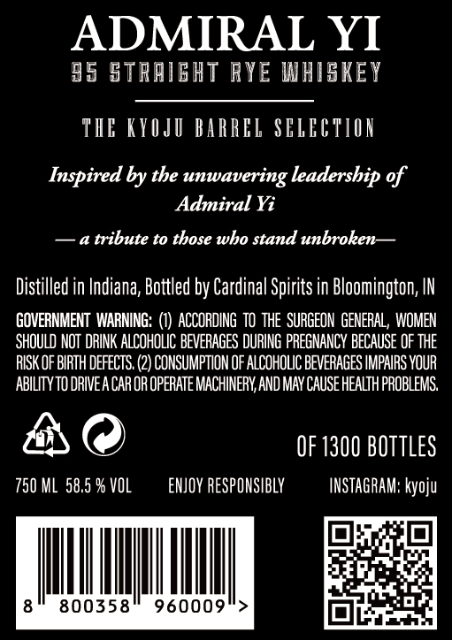
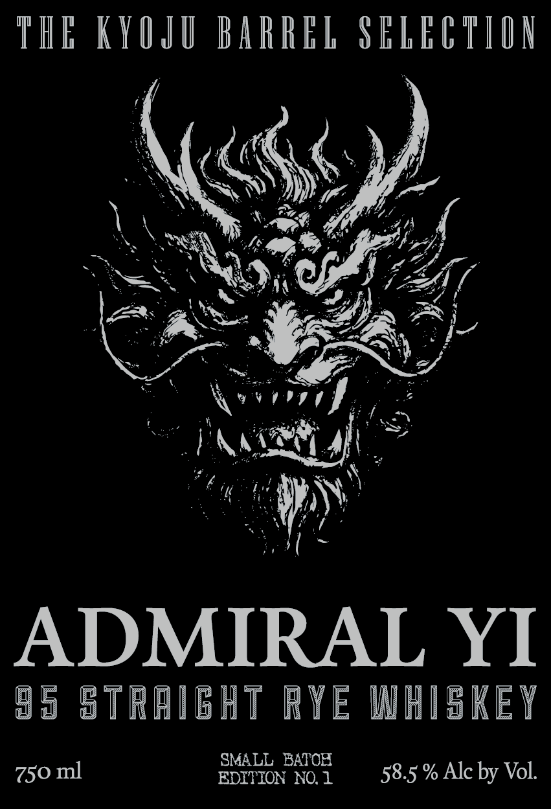

# TTB COLA Label Images - TTBID 26036001000155

**Brand Name:** ADMIRAL YI

**Issue Date:** 02/20/2026

**Origin Code:** 19

**Product Class/Type:** 102

**Source:** [TTB Public COLA Registry](https://ttbonline.gov/colasonline/viewColaDetails.do?action=publicFormDisplay&ttbid=26036001000155)

## Label Images

### Back Label

### Front Label

## Extracted Label Text

*Text extracted via OCR - may contain errors*

### Back Label

ADMIRAL YI

95 STRAIGHT RYE WHISKEY

THE KYOJU BARREL SELECTION

Inspired by the unwavering leadership of

Admiral Yi

—a tribute to those who stand unbroken—

Distilled in Indiana, Bottled by Cardinal Spirits in Bloomington, IN

GOVERNMENT WARNING: (1) ACCORDING TO THE SURGEON GENERAL, WOMEN

SHOULD NOT DRINK ALCOHOLIC BEVERAGES DURING PREGNANCY BECAUSE OF THE

RISK OF BIRTH DEFECTS. (2) CONSUMPTION OF ALCOHOLIC BEVERAGES IMPAIRS YOUR

ABILITY TO DRIVEA CAR OR OPERATE MACHINERY, AND MAY CAUSE HEALTH PROBLEMS.

AO

OF 1300 BOTTLES

750 ML 58,5 % VOL

ENJOY RESPONSIBLY

INSTAGRAM: kyoju

io} ba oe,

|

|

|

|

|

eRi

Er’

8

800358

960009

>

of,

Eli

awa

### Front Label

THE KYO

y

JU BARREL SELEUTIDN

GQ

¢.

We

Fed.

ad

Lf /

“7

ae gt

ZA

i

co”

PAsA

que

Se AN

as Pe

ve’

ADMIRAL YI

95 STRAIGHT RYE WHISKEY

750 ml

EDITION NO.1 —«5 8.5. % Alc by Vol.

SMALL BATOR
