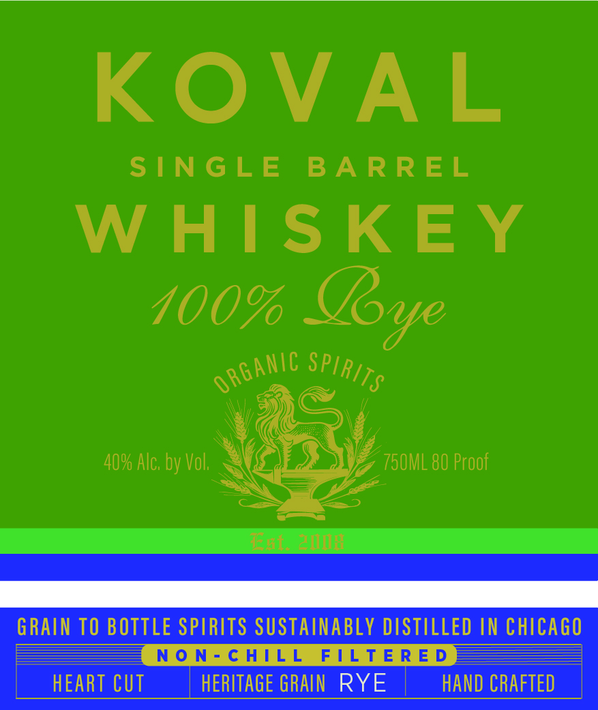
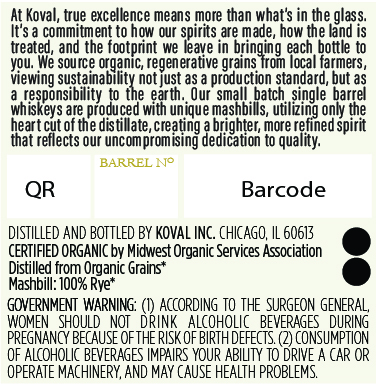

# TTB COLA Label Images - TTBID 26036001000165

**Brand Name:** KOVAL

**Fanciful Name:** 100% RYE

**Issue Date:** 02/10/2026

**Origin Code:** 04

**Product Class/Type:** 140

**Source:** [TTB Public COLA Registry](https://ttbonline.gov/colasonline/viewColaDetails.do?action=publicFormDisplay&ttbid=26036001000165)

## Label Images

### Front Label

### Label 2

## Extracted Label Text

*Text extracted via OCR - may contain errors*

### Front Label

KOVAL

SINGLE BARREL

WHISKEY

100% Bye

we ug

4 HC

40% Alc. by Vol.

a

hy

7 750ML 80 Proof

WG

—S——"

=Z2

ial, Se

### Label 2

At Koval, true excellence means more than what's in the glass.

It's a commitment to how our spirits are made, how the land is

treated, and the footprint we leave in bringing each bottle to

Wu. We source organic, regenerative grains from local farmers,

‘Viewing sustainability not just as a production standard, but as

sibility to

th. Our sme

jatch, single barrel

wie

are produced wit

i

‘unique mas

s

iH

vik

s, utilizing only th

heart cut of the distillate, creating

E

er

brighter, more r

i

pfined spirit,

that reflects our uncompromising

dication to quality,

BARREL N°

Barcode

QR

DISTILLED AND BOTTLED BY KOVAL INC. CHICAGO, IL 60613,

CERTIFIED ORGANIC by Midwest Organic Services Association

e

istilled from Organic Grains*

‘Mashbill: 100% Rye*

GOVERNMENT WARNING: (1) ACCORDING TO THE SURGEON GENERAL,

RAGES DURING

PRE AAN EAS: OF AN OF IHC

(@ CONSUMPTION

OF ALCOHOLIC BEVERAGES IMPAIRS YOUR ABILITY TO DRIVE A CAR OR

OPERATE MACHINERY, AND MAY CAUSE HEALTH PROBLEMS.
