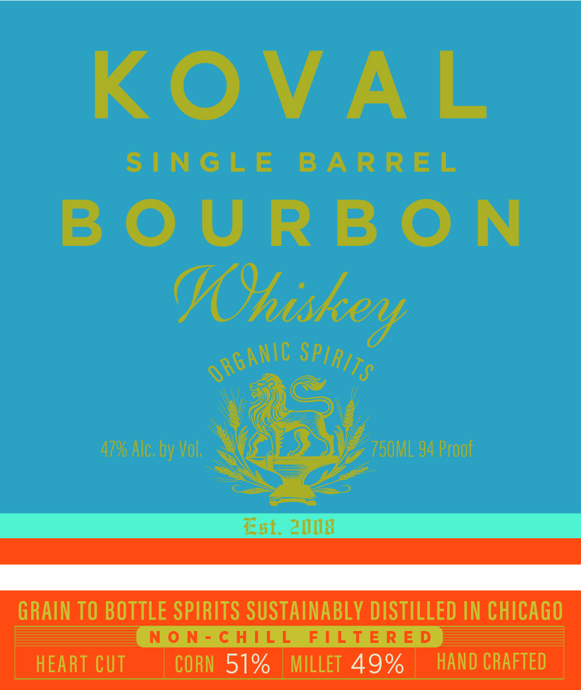
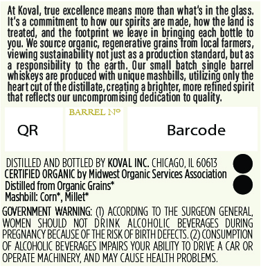

# TTB COLA Label Images - TTBID 26036001000189

**Brand Name:** KOVAL

**Issue Date:** 02/11/2026

**Origin Code:** 04

**Product Class/Type:** 141

**Source:** [TTB Public COLA Registry](https://ttbonline.gov/colasonline/viewColaDetails.do?action=publicFormDisplay&ttbid=26036001000189)

## Label Images

### Front Label

### Label 2

## Extracted Label Text

*Text extracted via OCR - may contain errors*

### Front Label

GRAIN TO BOTTLE SPIRITS SUSTAINABLY DISTILLED IN CHICAGO

NON-CHILL FILTERED

MILLET 49%

HAND CRAFTED

### Label 2

At Koval, true excellence means more than what's in the glass.

It's a commitment to how our spirits are made, how the land is.

treated, and the footprint we leave in bringing each bottle to

Wu. We source organic, regenerative grains from local farmers,

‘Viewing sustainability not just as a production standard, but as

sponsibility to

th. Our sme

jatch, single barr

wi

‘eys are produced wit

i

unique mas

s

iH

vi

s, utilizing only the

heart cut of the distillate, creating

E

Je

brighter, more

a ined spirit

that reflects our uncompromising

\dication to qui

BARREL N°

QR

Barcode

DISTILLED AND BOTTLED BY KOVAL INC. CHICAGO, IL 60613

CERTIFIED ORGANIC by Midwest Organic Services Association

e

Distilled from Organic Grains*

e

Mashbill: Corn’, Millet*

GOVERNMENT WARNING: (1) ACCORDING TO THE SURGEON GENERAL,

\GES_ DURING

PREAH OF HAN OF THEE.)

CONSUMPTION

OF ALCOHOLIC BEVERAGES IMPAIRS YOUR ABILITY TO DRIVE A CAR OR

OPERATE MACHINERY, AND MAY CAUSE HEALTH PROBLEMS.
