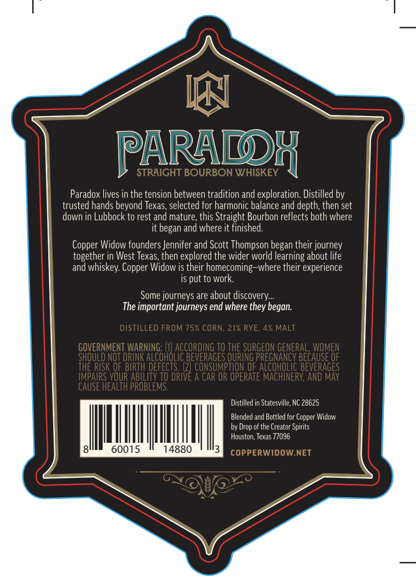
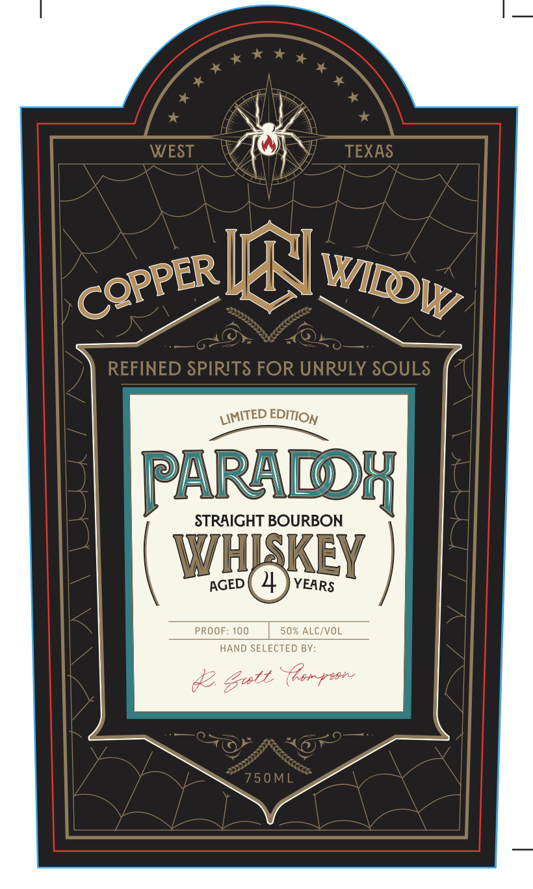

# TTB COLA Label Images - TTBID 26036001000216

**Brand Name:** COPPER WIDOW

**Fanciful Name:** PARADOX STRAIGHT BOURBON WHISKEY

**Issue Date:** 02/09/2026

**Origin Code:** 44

**Product Class/Type:** 101

**Source:** [TTB Public COLA Registry](https://ttbonline.gov/colasonline/viewColaDetails.do?action=publicFormDisplay&ttbid=26036001000216)

## Label Images

### Back Label

### Front Label

## Extracted Label Text

*Text extracted via OCR - may contain errors*

### Back Label

&

RB

PARADDH

Paradox lives in the tension between tradition and exploration. Distilled by

trusted hands beyond Texas, selected for harmonic balance and depth, then set

down in Lubbock to rest and mature, this Straight Bourbon reflects both where

it began and where it finished

Copper Widow founders Jennifer and Scott Thompson began their journey

together in West Texas, then explored the wider world learning about life

and whiskey. Copper Widow is their homecoming—where their experience

is put to work.

Some journeys are about discovery...

The important journeys end where they began.

Distilled in Statesville, NC 28625,

Blended and Bottled for Copper Widow

by Drop of the Creator Spirits

i

Houston, Texas 77096

Il

015

148

|

### Front Label

COPPER NI Witp yy,

PARADDH

| wag }

HAND SELECTED BY
