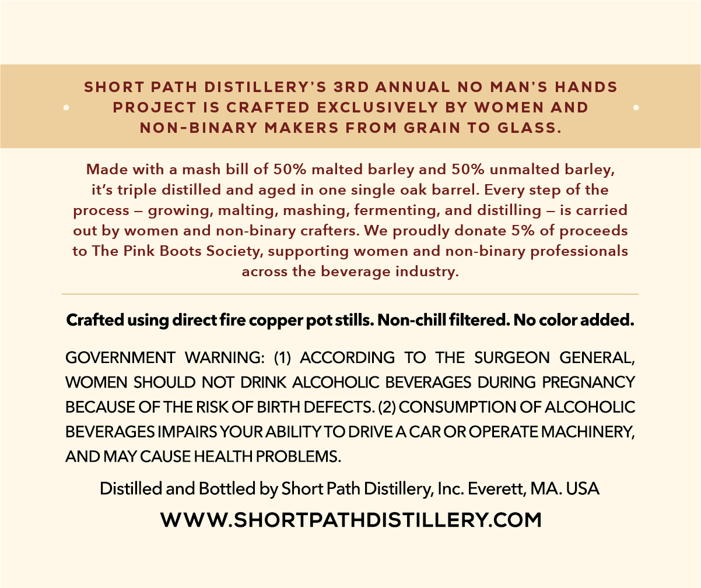
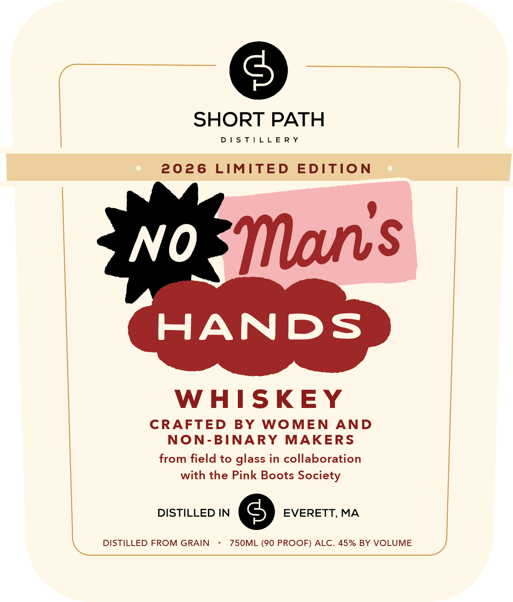
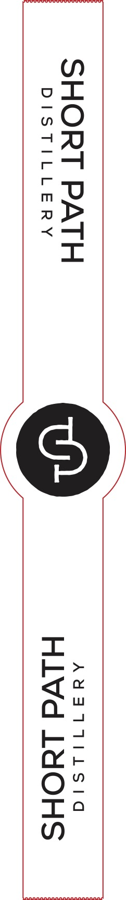

# TTB COLA Label Images - TTBID 26036001000246

**Brand Name:** SHORT PATH DISTILLERY

**Issue Date:** 02/09/2026

**Origin Code:** 26

**Product Class/Type:** 140

**Source:** [TTB Public COLA Registry](https://ttbonline.gov/colasonline/viewColaDetails.do?action=publicFormDisplay&ttbid=26036001000246)

## Label Images

### Back Label

### Front Label

### Label 3

## Extracted Label Text

*Text extracted via OCR - may contain errors*

*1 image(s) excluded: text did not meet readability threshold*

### Back Label

SHORT PATH DISTILLERY’S 3RD ANNUAL NO MAN’S HANDS

PROJECT IS CRAFTED EXCLUSIVELY BY WOMEN AND

NON-BINARY MAKERS FROM GRAIN TO GLASS.

Made with a mash bill of 50% malted barley and 50% unmalted barley,

it’s triple distilled and aged in one single oak barrel. Every step of the

process — growing, malting, mashing, fermenting, and distilling — is carried

out by women and non-binary crafters. We proudly donate 5% of proceeds

to The Pink Boots Society, supporting women and non-binary professionals

across the beverage industry.

Crafted using direct fire copper pot stills. Non-chill filtered. No color added.

GOVERNMENT WARNING: (1) ACCORDING TO THE SURGEON GENERAL,

WOMEN SHOULD NOT DRINK ALCOHOLIC BEVERAGES DURING PREGNANCY

BECAUSE OF THE RISK OF BIRTH DEFECTS. (2) CONSUMPTION OF ALCOHOLIC

BEVERAGES IMPAIRS YOUR ABILITY TO DRIVE A CAR OR OPERATE MACHINERY,

AND MAY CAUSE HEALTH PROBLEMS.

Distilled and Bottled by Short Path Distillery, Inc. Everett, MA. USA

WWW.SHORTPATHDISTILLERY.COM

### Front Label

SHORT PATH

DISTILLERY

2026 LIMITED EDITION

Mans

WHISKEY

CRAFTED BY WOMEN AND

NON-BINARY MAKERS

from field to glass in collaboration

with the Pink Boots Society

DISTILLED FROM GRAIN

750ML (90 PROOF) ALC. 45% BY VOLUME

XN

w,
