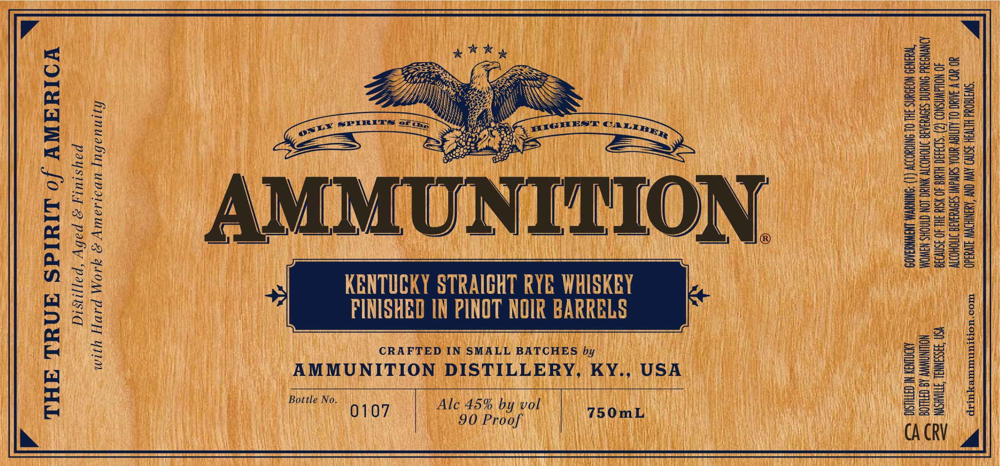

# TTB COLA Label Images - TTBID 26036001000297

**Brand Name:** AMMUNITION

**Issue Date:** 02/13/2026

**Origin Code:** 43

**Product Class/Type:** 102

**Source:** [TTB Public COLA Registry](https://ttbonline.gov/colasonline/viewColaDetails.do?action=publicFormDisplay&ttbid=26036001000297)

## Label Images

### Label 1

### Label 2

## Extracted Label Text

*Text extracted via OCR - may contain errors*

### Label 1

4

ING: (1) ACCORDING 10 THE SURGEON GENERAL,
DRINK ALCOHOLIC: BEVERAGES DURING PREGNANCY
OF BIRTH DEFECTS, (2) CONSUMPTION. OF

S IMPAIRS YOUR-ABILITY 10 DRIVE A CAR OR

AMMUNI TION.

KENTUCKY STRAIGHT RYE WHISKEY
PINISHED IN PINOT NOIR BARRELS

CRAFTED IN SMALL BATCHES by

AMMUNITION DISTILLERY, KY., USA

OPERATE MACHINERY, AND MAY CAUSE HEALTH PROBLEMS.

GOVERNMENT WARNING: (1) AC
WOMEN SHOULD NO
BECAUSE OF THE RIS
ALCOHOLIC BEVERAG

Distilled, Aged & Finished
with Hard Work & American Ingenuity

BOTTLED BY AMMUNITION

DISTILLED IN-KENTUCKY

Bottle No. Ale 45% by vol
0107 90 Proof Libis

wt
0
bead
ex
x
=
re
>
[-
=
ex
b=!
A,
nN
fa
D
ec
Es
ba
=
E

> WASHVILLE, TENNESSEE, USA
>» drinkammunition.com

cy
_—
oOo

### Label 2

ESS

ay

e)

(PH

SSS

HSS

D orm

SS

HSS

Gm

SS

uae

ELUTE EELUEELULEOLULEOLUEOPOLEOTOLUOLOLUMEULEREOLULOPEUOLUUOPUOUOPUUL TLL TULUL ILOILO LUO

*

PRODUCED IN SMALL BATCHES

*

*

ITH ZERO B

VUTEC ECT DE TE EETECETCEEEEECETECEDEEee

av;

7

Ts ™

x

Zs x

i

Ts
