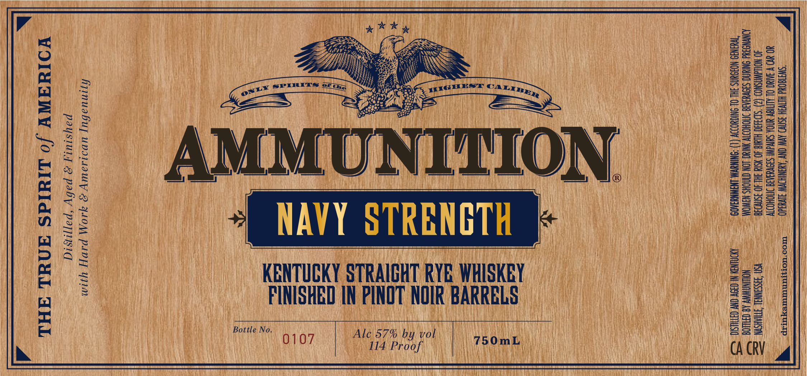

# TTB COLA Label Images - TTBID 26036001000306

**Brand Name:** AMMUNITION

**Fanciful Name:** NAVY STRENGTH

**Issue Date:** 02/11/2026

**Origin Code:** 43

**Product Class/Type:** 102

**Source:** [TTB Public COLA Registry](https://ttbonline.gov/colasonline/viewColaDetails.do?action=publicFormDisplay&ttbid=26036001000306)

## Label Images

### Label 1

### Label 2

## Extracted Label Text

*Text extracted via OCR - may contain errors*

### Label 1

Fj

|

ie

|

Vesa |

fe SS

eK ye ul

nu

il

Hl

Zoe

Nw

ball

z=

Seu S

y

fl

ets

hy

Be

Sas

bt,

Wy)

i

i)

\

i

oc

Ss

eS

=o

o£

ie)

SEOs |

aa,

Bas

aS

i

a

rs sPrRr

y=

ips

arrRE,,

ons

=

oe

Ses

ES

Epes)

1]

es

=

Se

Se

o>

ee

1

=f

|

=z

=s

eo ae

SS

eat)

i

4

ed ed

ION

=:

up

=o

sS

S=

EAE

Ul

i —

wn

u

A

YY

rk

B

NGT

RB

Ret

ae

Pa

(oi

Oo)

do

Ui}

fl

iS

VB ft

KENTUCKY

RAIGHT RY HISKEY

aS

a=

Seu

iB

FINISHED

i

2=

Ssza

ie)

NOT NOIR BARRELS.

2=

wee

eas

=i

ii

Bottle No

“Ale 57% by vol.

SS2

a)

107

750

114 Proof

\ i

ba OE

Pr Ri

CACRV

Ty

re

the]

vy

iN

### Label 2

DP )/

nd

Oy

Wie

1 |

i

G

tt a

UNNI

TTT

UVLNNVNNUNTNN UNV EUT UHI

THIN

III)

IIH

HIIIII

UIT

ae

1 |

UHH

wu

HI

TT

II

E

A

HI

HHH

eA:

Qa

]

—

+9)

uU

i

»);

<4

ANG

oS Ae
