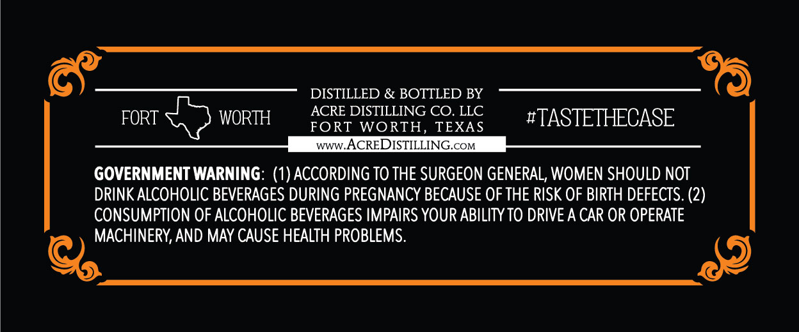
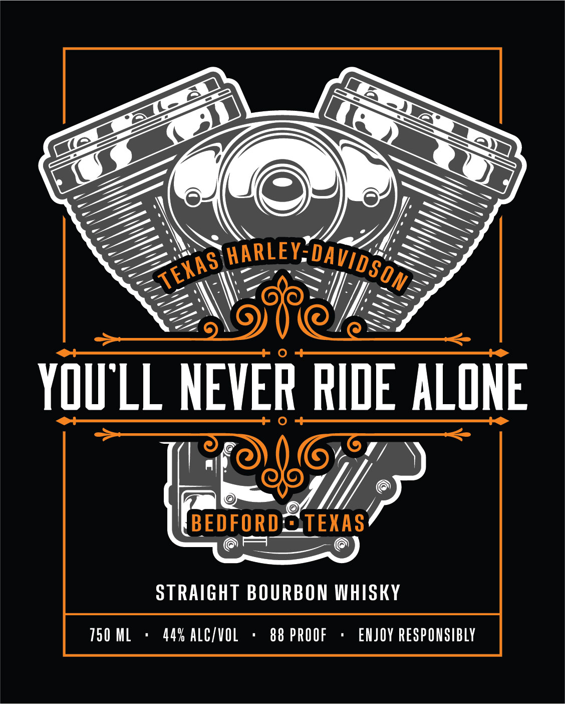

# TTB COLA Label Images - TTBID 26036001000416

**Brand Name:** YOU'LL NEVER RIDE ALONE BEDFORD TEXAS STRAIGHT BOURBON WHISKY

**Issue Date:** 02/10/2026

**Origin Code:** 44

**Product Class/Type:** 101

**Source:** [TTB Public COLA Registry](https://ttbonline.gov/colasonline/viewColaDetails.do?action=publicFormDisplay&ttbid=26036001000416)

## Label Images

### Back Label

### Front Label

## Extracted Label Text

*Text extracted via OCR - may contain errors*

### Back Label

(ae DISTILLED & BOTTLED BY _
ACRE DISTILLING CO. LLC
FORT ae WORTH fort wortH Texas  #TASTETHECASE
ee ww WACREDISTILLING oo.
GOVERNMENT WARNING: (1) ACCORDING TO THE SURGEON GENERAL, WOMEN SHOULD NOT
DRINK ALCOHOLIC BEVERAGES DURING PREGNANCY BECAUSE OF THE RISK OF BIRTH DEFECTS. (2)
CONSUMPTION OF ALCOHOLIC BEVERAGES IMPAIRS YOUR ABILITY TO DRIVE A CAR OR OPERATE
qu AND MAY CAUSE HEALTH PROBLEMS. A)

### Front Label

Car ®
BSS AAS
AOU SS
<SEMWOSIGLS
YOULL NEVER RIDE ALONE
eee
ae J// 5
ors 6
STRAIGHT BOURBON WHISKY
