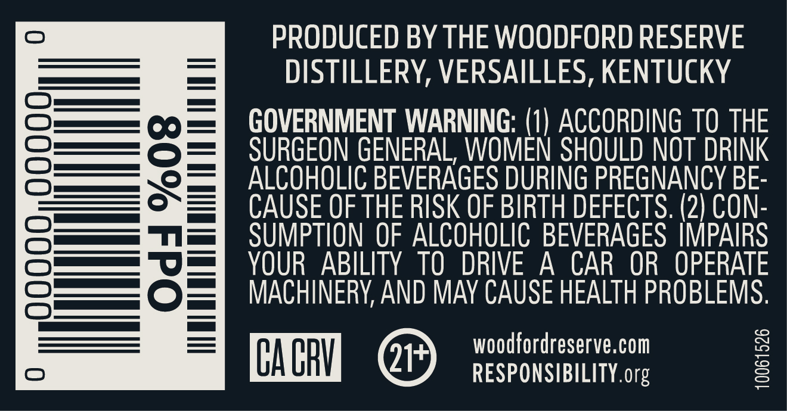
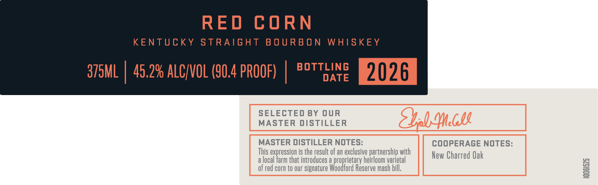

# TTB COLA Label Images - TTBID 26036001000437

**Brand Name:** WOODFORD RESERVE

**Fanciful Name:** DISTILLERY SERIES

**Issue Date:** 02/09/2026

**Origin Code:** 22

**Product Class/Type:** 101

**Source:** [TTB Public COLA Registry](https://ttbonline.gov/colasonline/viewColaDetails.do?action=publicFormDisplay&ttbid=26036001000437)

## Label Images

### Back Label

### Front Label

### Label 1

### Label 4

### Label 5

## Extracted Label Text

*Text extracted via OCR - may contain errors*

### Back Label

PRODUCED BY THE WOODFORD RESERVE

DISTILLERY, VERSAILLES, KENTUCKY

OO —_—=

OF —

GOVERNMENT WARNING: (1) ACCORDING TO THE

Ol

OU

OT DRINK

o=

ALCOHOLIC BEVERAGES DURING PREGNANCY BE-

<=

CAUSE OF THE RISK OF BIRTH DEFECTS. (2) CON-

o_——

SUMPTION OF ALCOHOLIC BEVERAGES IMPAIRS

Om =

YOUR ABILITY TO DRIVE A CAR OR OPERATE

(SD Jo

2 | —

MACHINERY, AND MAY CAUSE HEALTH PROBLEMS.

woodfordreserve.com

HE @

RESPONSIBILITY. org

### Front Label

RED CORN

KENTUCKY STRAIGHT BOURBON WHISKEY

TLING

375ML | 45.2% ALC/VOL (90.4 PROOF) | 82°

DATE

2026

SELECTED BY OUR

MASTER DISTILLER

MASTER DISTILLER NOTES:

COOPERAGE NOTES

alo

his expression is the result of an exc

that intr

loom varietal

rtnership with

New Charred Oak

of red corn to our si

ure

ford Re

mash bil

### Label 1

STILLER ERI ¢«

WOODFORD RESERVE

a

—<

### Label 4

PEEP EEEEED EEE PTET EE EE EEE PTET EEE EERE EEE ~

LIMITED

RELEASE

PEEEEEEE ED EE EET EE EE EEE PEPE TEEPE EE EEE EEE TEEPE EEE EEE EEE EEE y

### Label 5

tint

PELEEUEEUEEEEETEEOEE

PELLUEEEUEEDEEEEEEEE

DOUUO OU

PEneneanee

benuniat

Vrtineaneds

PEDUEEUEEEEREEETEEE EE

tonite

HILVE 1TIVWS

HANOCRAFTEO

O3aljavyuagogNnvu

SMALL BATCH

PEUEEUUEEDEUEETT EEG

DEDUCE EUUEOCEE EEOC EET

PEUEEEGEEGEe eee

Preennieeds

PEDUUEUEEEEO Tea

tonne
