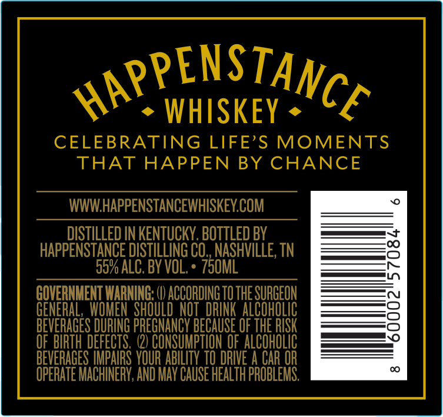
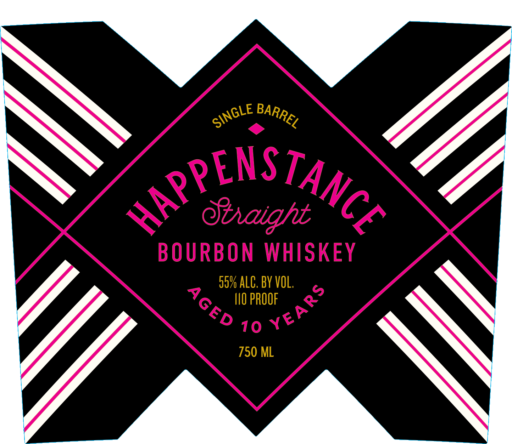

# TTB COLA Label Images - TTBID 26036001000461

**Brand Name:** HAPPENSTANCE

**Issue Date:** 02/09/2026

**Origin Code:** 43

**Product Class/Type:** 101

**Source:** [TTB Public COLA Registry](https://ttbonline.gov/colasonline/viewColaDetails.do?action=publicFormDisplay&ttbid=26036001000461)

## Label Images

### Back Label

### Front Label

## Extracted Label Text

*Text extracted via OCR - may contain errors*

### Back Label

gPENSTAY,

art

» WHISKEY = 6

CELEBRATING LIFE’S MOMENTS

THAT HAPPEN BY CHANCE

WWW.HAPPENSTANCEWHISKEY.COM

DISTILLED IN KENTUCKY. BOTTLED BY

HAPPENSTANCE DISTILLING CO., NASHVILLE, TN

997 ALC. BY VOL. * 730ML

GOVERNMENT WARNING: ()) ACCORDING 70 THE SURGEON

LC

BEVERAGES DURING PREGNANCY BECAUSE OF THE RISK

BIRT

FECTS. (2) CONSUMP y OF vy

OPERATE MACHINERY, AND MAY CAUSE HEALT HUB

BEVERAGES IMPAIRS YOUR ABILITY

DRIVE A CAR

### Front Label

90% ALC. BY VOL

I10 PROOF

750 ML
