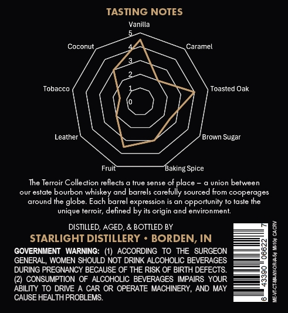
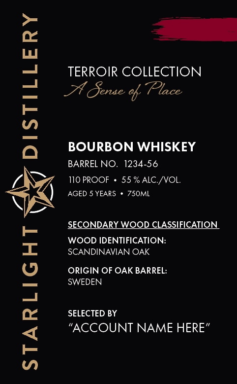

# TTB COLA Label Images - TTBID 26036001000471

**Brand Name:** STARLIGHT DISTILLERY

**Issue Date:** 02/12/2026

**Origin Code:** 19

**Product Class/Type:** 141

**Source:** [TTB Public COLA Registry](https://ttbonline.gov/colasonline/viewColaDetails.do?action=publicFormDisplay&ttbid=26036001000471)

## Label Images

### Back Label

### Front Label

## Extracted Label Text

*Text extracted via OCR - may contain errors*

### Back Label

TASTING NOTES

Vanilla

Tobacco

Leather' ‘Brown Sugar

Fru Baking Spice

The Tertoir Collection reflects a true sense of place ~ a union between
our estate bourbon whiskey and barrels carefully sourced from cooperages
around the globe. Each barrel expression is an opportunity to taste the
unique terroir, defined by is origin and environment

DISTILLED, AGED, & BOTTLED BY
STARLIGHT DISTILLERY * BORDEN, IN
GOVERNMENT WARNING: (1) ACCORDING TO THE SURGEON
GENERAL, WOMEN SHOULD NOT DRINK ALCOHOLIC BEVERAGES
DURING PREGNANCY BECAUSE OF THE RISK OF BIRTH DEFECTS.
(2) CONSUMPTION OF ALCOHOLIC BEVERAGES IMPAIRS YOUR
ABILITY TO DRIVE A CAR OR OPERATE MACHINERY, AND MAY

CAUSE HEALTH PROBLEMS.

MEVECTAMATORASE MIE CACRY

### Front Label

STARLIGHT yy DISTILLERY

TERROIR COLLECTION
AA Ginko, Place

BOURBON WHISKEY
BARREL NO. 1234-56

110 PROOF + 55% ALC./VOL.
AGED 5 YEARS * 750ML

SECONDARY WOOD CLASSIFICATION

WOOD IDENTIFICATION:
SCANDINAVIAN OAK

ORIGIN OF OAK BARREL:
SWEDEN

SELECTED BY
“ACCOUNT NAME HERE”
