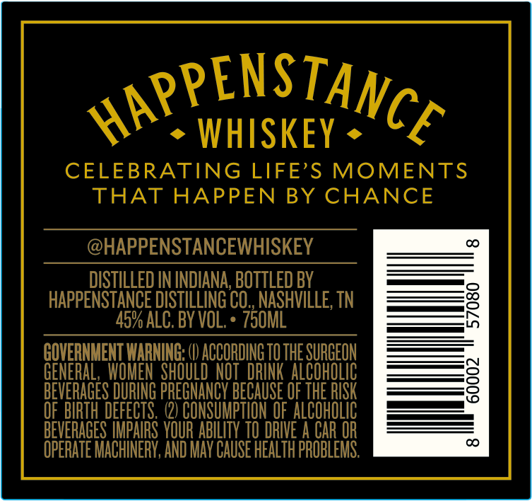
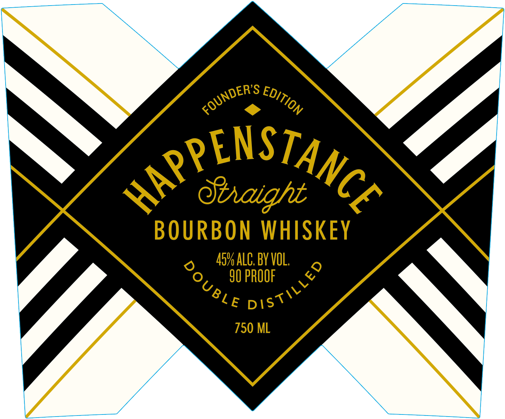

# TTB COLA Label Images - TTBID 26036001000486

**Brand Name:** HAPPENSTANCE

**Issue Date:** 02/09/2026

**Origin Code:** 43

**Product Class/Type:** 101

**Source:** [TTB Public COLA Registry](https://ttbonline.gov/colasonline/viewColaDetails.do?action=publicFormDisplay&ttbid=26036001000486)

## Label Images

### Back Label

### Front Label

## Extracted Label Text

*Text extracted via OCR - may contain errors*

*1 image(s) excluded: text did not meet readability threshold*

### Back Label

WO". WHISKEY - C
CELEBRATING LIFE’S MOMENTS
THAT HAPPEN BY CHANCE

@HAPPENSTANCEWHISKEY _—___*
DISTILLED IN INDIANA, BOTTLED BY —=.
HAPPENSTANCE DISTILLING CO., NASHVILLE, TN =
45% ALC. BY VOL. + 750ML ——s
| ———
GENERAL, WOMEN SHOULD NOT DRINK ALCOHOLIC j-——_—<
BEVERAGES DURING PREGNANCY BECAUSE OF THE RISK [te
OF BIRTH DEFECTS. (2) CONSUMPTION OF ALCOHOLIC [_-————!
BEVERAGES IMPAIRS YOUR ABILITY TO DRIVE A CAR OR ——
OPERATE MACHINERY, AND MAY CAUSE HEALTH PROBLEMS. °°
