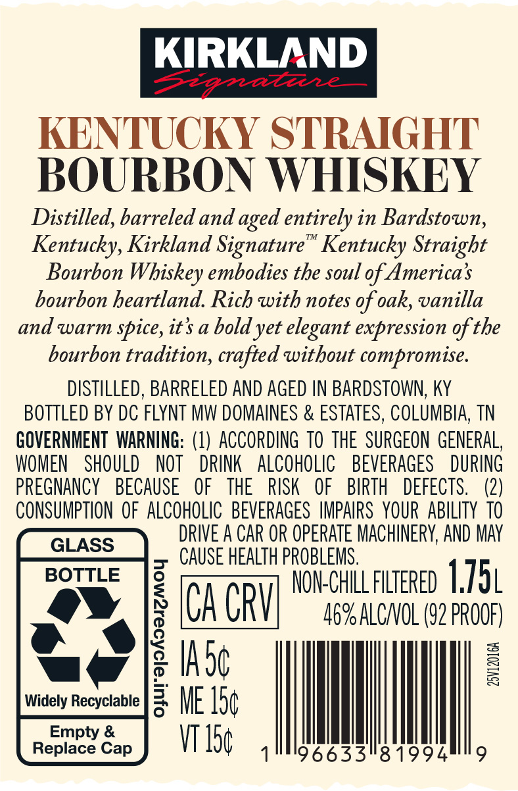
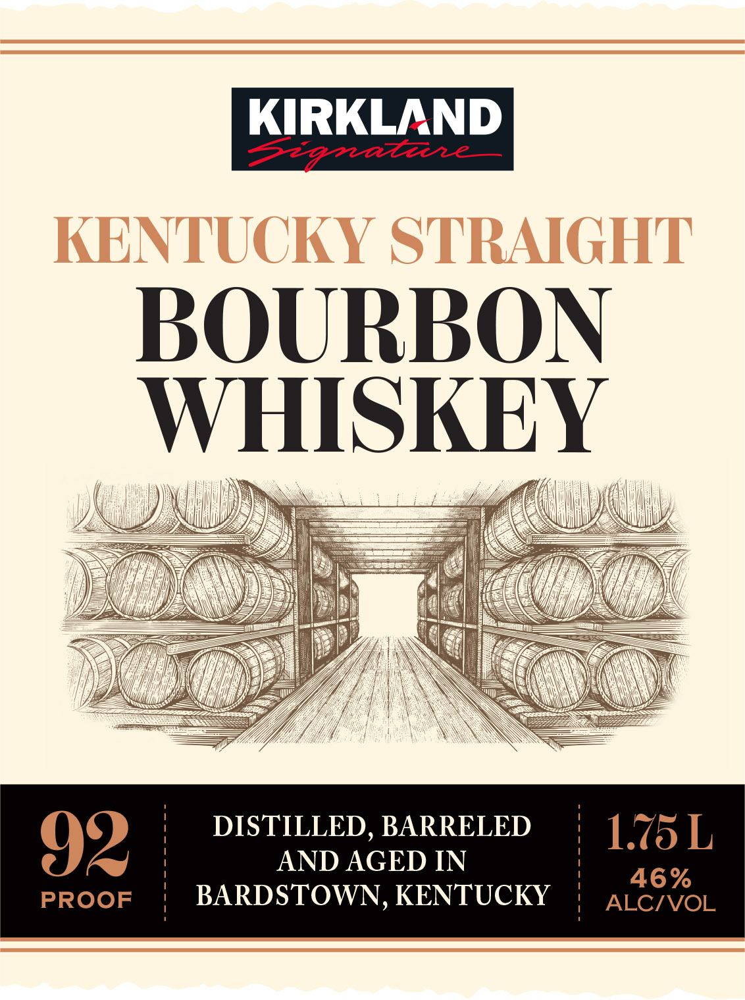
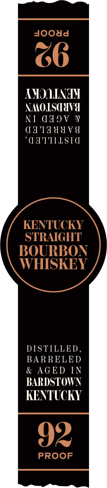

# TTB COLA Label Images - TTBID 26036001000814

**Brand Name:** KIRKLAND SIGNATURE

**Issue Date:** 02/10/2026

**Origin Code:** 43

**Product Class/Type:** 101

**Source:** [TTB Public COLA Registry](https://ttbonline.gov/colasonline/viewColaDetails.do?action=publicFormDisplay&ttbid=26036001000814)

## Label Images

### Back Label

### Front Label

### Label 3

## Extracted Label Text

*Text extracted via OCR - may contain errors*

### Back Label

KENTUCKY STRAIGHT

BOURBON WHISKEY

Distilled, barreled and aged entirely in Bardstown,

Kentucky, Kirkland Signature” Kentucky Straight

Bourbon Whiskey embodies the soul of America’s

bourbon heartland. Rich with notes of oak, vanilla

and warm spice, it’ a bold yet elegant expression of the

bourbon tradition, crafted without compromise

DISTILLED, BARRELED AND AGED IN BARDSTOWN, KY

BOTTLED BY DC FLYNT MW DOMAINES & ESTATES, COLUMBIA, TN

GOVERNMENT WARNING: (1) ACCORDING TO THE SURGEON GENERAL,

WOMEN SHOULD NOT DRINK ALCOHOLIC BEVERAGES DURING

PREGNANCY BECAUSE OF THE RISK OF BIRTH DEFECTS

(2)

CONSUMPTION OF ALCOHOLIC BEVERAGES IMPAIRS YOUR ABILITY 10

DRIVE A CAR OR OPERATE MACHINERY, AND MAY

CAUSE HEALTH PROBLEMS

BOTTLE

NON-CHILL FILTERED

1751

CA CRY

AG%ALCIVOL (92 PROOF)

2 IAde

Widely Recyclable |

3 ME 1h¢

‘i

VI The

96633581994

|

### Front Label

Z

BOURBON

WHISKEY

Mah

a.

Wi

i |

Li)

Nil

i

oi

}

nad

pi)

y

SSS a

lus

I

cy

\

DISTILLED, BARRELED

I

L

Jz

AND AGED IN

46%

PROOF

'

BARDSTOWN, KENTUCKY

ALC/VOL

### Label 3

AMOQINAY

NMOLSCUVa

NI dddV ¥

qa 1Tdddvd

“CATTILSIC

DISTILLED,

BARRELED

& AGED IN

BARDSTOWN

KENTUCKY
