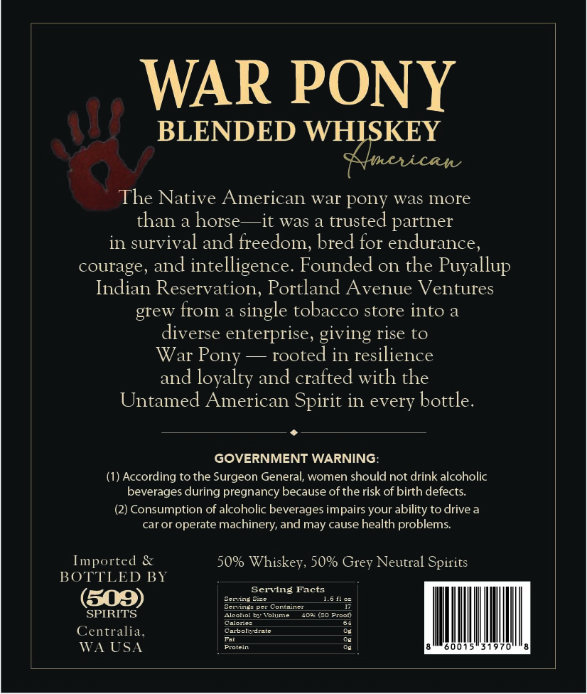
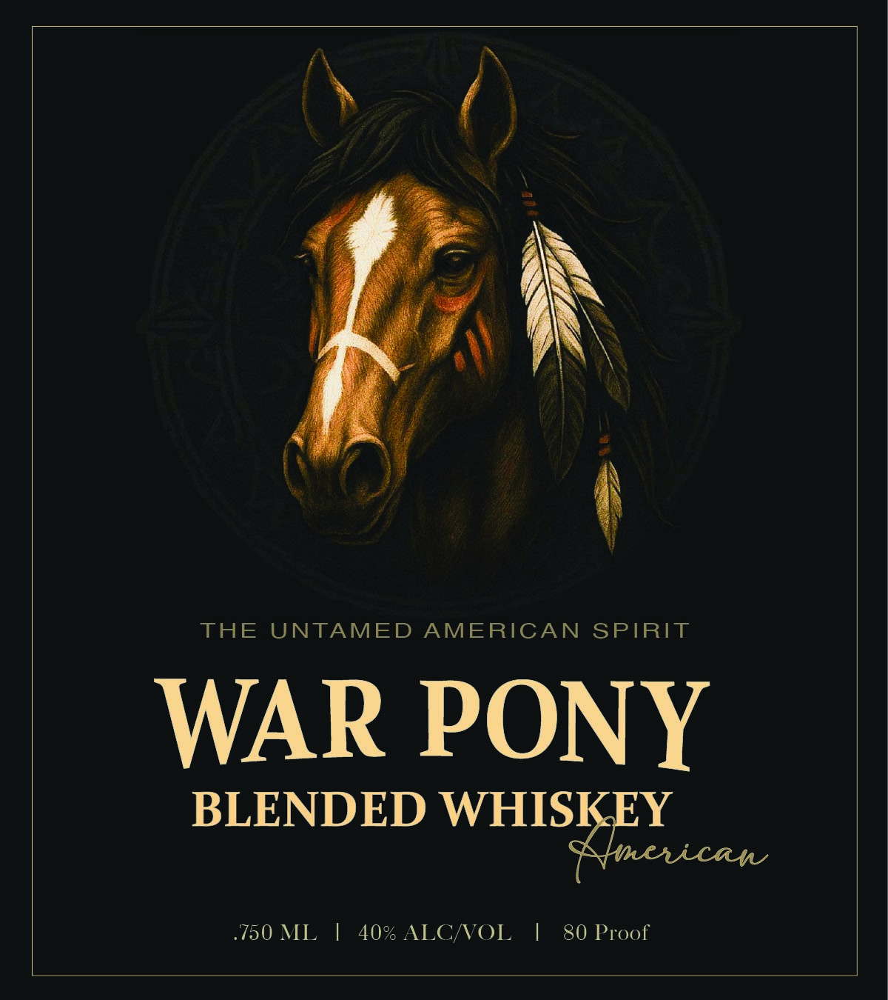

# TTB COLA Label Images - TTBID 26036001000816

**Brand Name:** WAR PONY BLENDED WHISKEY AMERICAN

**Issue Date:** 02/10/2026

**Origin Code:** 07

**Product Class/Type:** 137

**Source:** [TTB Public COLA Registry](https://ttbonline.gov/colasonline/viewColaDetails.do?action=publicFormDisplay&ttbid=26036001000816)

## Label Images

### Back Label

### Front Label

## Extracted Label Text

*Text extracted via OCR - may contain errors*

### Back Label

WAR PONY

BLENDED WH KEY

The Native American war pony was more

than a horse—it was a trusted partner

in survival and freedom, bred for endurance,

courage, and intelligence. Founded on the Puyallup

Indian Reservation, Portland Avenue Ventures

grew from a single tobacco store into a

diverse enterprise, giving rise to

War Pony — rooted in resilience

and loyalty and crafted with the

Untamed American Spirit in every bottle.

«

GOVERNMENT WARNING:

(1) According to the Surgeon General, women should not drink alcoholic

beverages during pregnancy because of the risk of birth defects.

(2) Consumption of alcoholic beverages impairs your ability to drive a

car or operate machinery, and may cause health problems.

In

rted &

50% Whiskey, 50% Grey Neutral Spirits

BO

LED BY

Serving Facts

ciated

1.6 fos

F

SPIRITS

Ales

Galeries

Carbotsdrate

lume. 408 9 reef

Os

Centralia,

os

Ill

|

WA USA

SES

oe

0015"31970.

### Front Label

THE UNTAMED AMERICAN SPIRIT

WAR PONY
BLENDED en plese

40% ALC/VOL | 80 Proof
