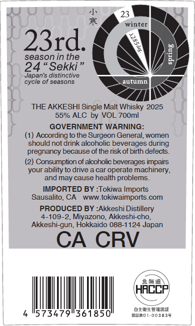
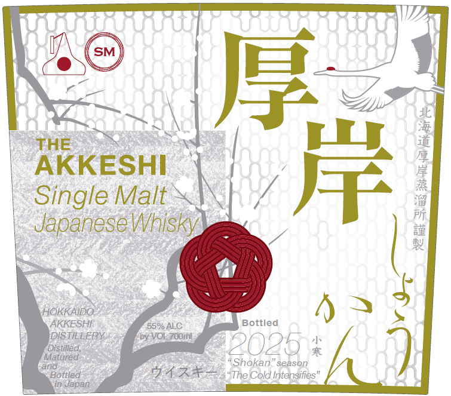

# TTB COLA Label Images - TTBID 26037001000040

**Brand Name:** THE AKKESHI

**Fanciful Name:** SHOKAN

**Issue Date:** 02/11/2026

**Origin Code:** 59

**Product Class/Type:** 118

**Source:** [TTB Public COLA Registry](https://ttbonline.gov/colasonline/viewColaDetails.do?action=publicFormDisplay&ttbid=26037001000040)

## Label Images

### Back Label

### Front Label

## Extracted Label Text

*Text extracted via OCR - may contain errors*

### Back Label

oe

Be

LW

ay

winter

<>

£931. 4

i)

season in the

ES

24 “Sekki”

Japan's distinctive

‘cycle of seasons

|

ar

THE AKKESHI Single Malt Whisky 2025

55% ALC by VOL 700m

GOVERNMENT WARNING:

(1) According to the Surgeon General, women

‘should not drink alcoholic beverages during

pregnaney because of the risk of birth defects.

‘of alcoholic:

your ability to drive a car operate machinery,

and may cause health problems.

IMPORTED BY :Tokiwa Imports

Sausalito, CA www.tokiwaimports.com

PRODUCED BY :Akkeshi Distillery

4-109-2, Miyazono, Akkeshi-cho,

Akkeshi-gun, Hokkaido 088-1124 Japan

CA CRV

AN

\ HACER

4

area eanm

WN

mimeo 1003838

_

### Front Label

UU

2®

}

3E

ml

madst

|

|

DaR

73

KESHI

tas

|

| Single Malt

|

ee

| Japanese Whisky.

®

fi

=

7 |

$

HOKKAIDO:

AX

AKKESHE

DISTILLERY:

by VOL 700m

SO%ALC

fo) Bottled

‘Matured

Distilled,

LO 25 s

Bottled

“Shokan” season

inJapan

¢ AAA “The Cold intensities”
