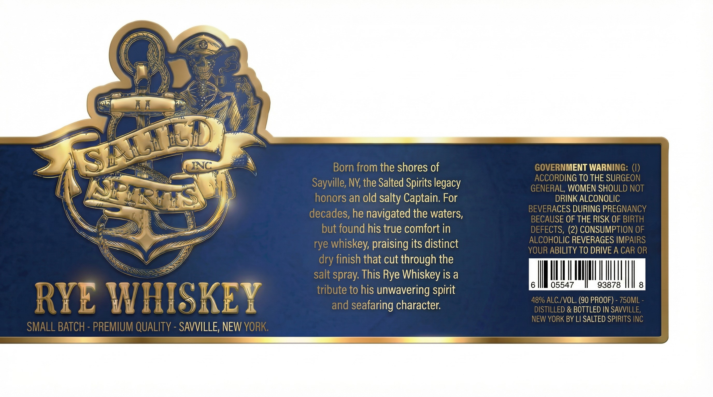

# TTB COLA Label Images - TTBID 26037001000149

**Brand Name:** SALTED SPIRITS INC RYE WHISKEY

**Issue Date:** 02/10/2026

**Origin Code:** 02

**Product Class/Type:** 142

**Source:** [TTB Public COLA Registry](https://ttbonline.gov/colasonline/viewColaDetails.do?action=publicFormDisplay&ttbid=26037001000149)

## Label Images

### Back Label

## Extracted Label Text

*Text extracted via OCR - may contain errors*

### Back Label

aN

Vi

2D

Sv,

Za

4

i I

— Es.

amma

b= fy

Six

: Ny Lae

a

vi

if

wl

}

J

SS Bs

)

BYWINC

A

Born from the shores of

GOVERNMENT WARNING

SJ

RDING TO THE SURGEC

Sayville, NY, the Salted Spirits legacy

ERAL, WOMEN SHOULD NO

= l

ie

DRINK ALCONOLIC

Aw

honors an old salty Captain. For

EVE

RACES DURING PREGNANC

decades, he navigated the waters

\

Yi

a

LZ

jb)

ECAUSE OF THE RISK OF B

but found his true comfort in

ECTS, (2)

CONSUMPTIO

SS

AL HOLIC REVERAGES IMPA

SSN

rye whiskey, praising its distinct

YO

{ ABILITY TO DRIVE A CAR

bey;

dry finish that cut through the

salt spray. This Rye Whiskey is a

WN

TN

6

|

05547

93878

LTC

tribute to his unwavering spirit

ALC./VOL. (90 PROOF) - 750M

6) EW

iiihe)

K

and seafaring character.

LED & BOTTLED IN SAVVI

YORK BY LI SALTED SPIRITS INC

REMIUM Q

JUALITY - SAVVILLE, NEW YOR
