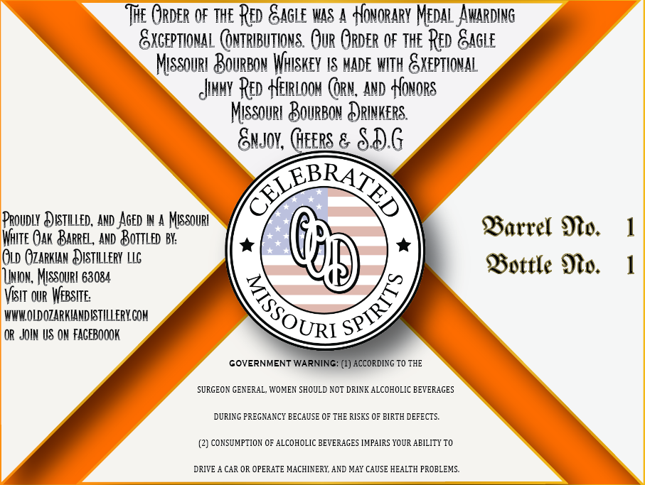
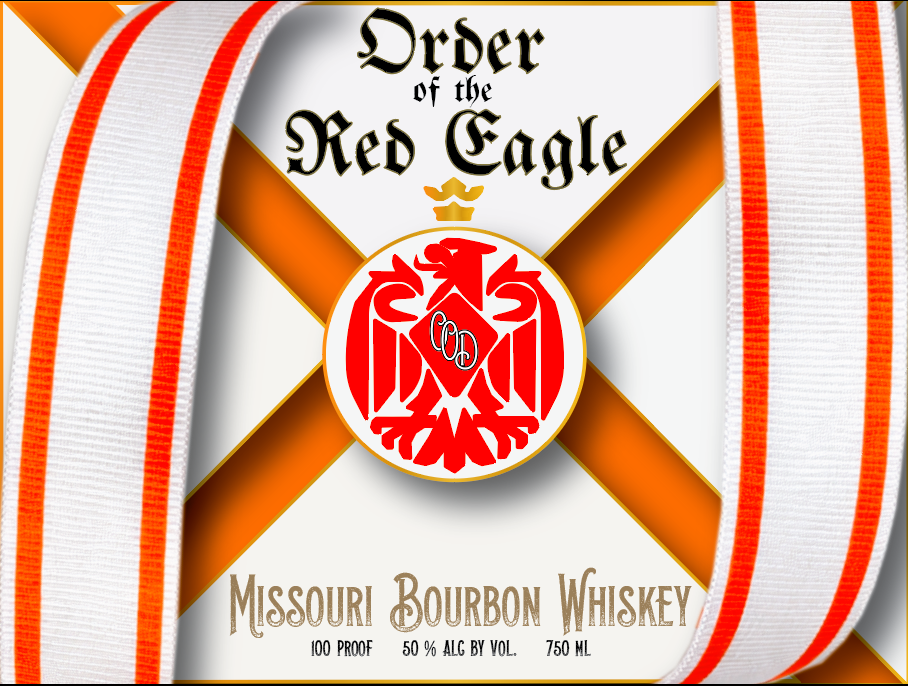

# TTB COLA Label Images - TTBID 26037001000161

**Brand Name:** ORDER OF THE RED EAGLE MISSOURI BOURBON WHISKEY

**Issue Date:** 02/23/2026

**Origin Code:** 29

**Product Class/Type:** 141

**Source:** [TTB Public COLA Registry](https://ttbonline.gov/colasonline/viewColaDetails.do?action=publicFormDisplay&ttbid=26037001000161)

## Label Images

### Back Label

### Label 1

## Extracted Label Text

*Text extracted via OCR - may contain errors*

### Back Label

‘THE GaveR OF THE RED GAGLE WAS A +HowoRARY MEDAL AWARDING
EXCEPTIONAL @NTRIBUTIONS. QUR ORDER OF THE RED GAGLE
Missourt BourBow WHISKEY 1S MADE WITH &XEPTIONAL
iNMY RED HEIRLOOM (RW, AND HONORS

MIssouR] BOURBON &)RINKERS.

Susy, Geers & SAG

PROUDLY E)STILLED, AND AGED IN A Missout
WiTE QAK BaReel, AND BorTLeD Bi:

OL GZARKIAN Q)ISTILLERY Lc
Union, Missouri 68034

Visit our WEBSITE:
WWWOLDOZARKIANDISTILLERY.COM
(OR JOIN US ON FAGEBOOOK

Barrel No.
Bottle Mo.

SURGEON GENERAL, WOMEN SHOULD NOT DRINK ALCOHOLIC BEVERAGES
DURING PREGNANCY BECAUSE OF THE RISKS OF BIRTH DEFECTS.
(2) CONSUMPTION OF ALCOHOLIC BEVERAGES IMPAIRS YOUR ABILITY TO

DRIVE A CAR OR OPERATE MACHINERY, AND MAY CAUSE HEALTH PROBLEMS.

### Label 1

Order

of the

Red Eagle

(by

MissouR! BOURBON Wiiskey

100 PROOF = 50% ALG BY VOL. 750
