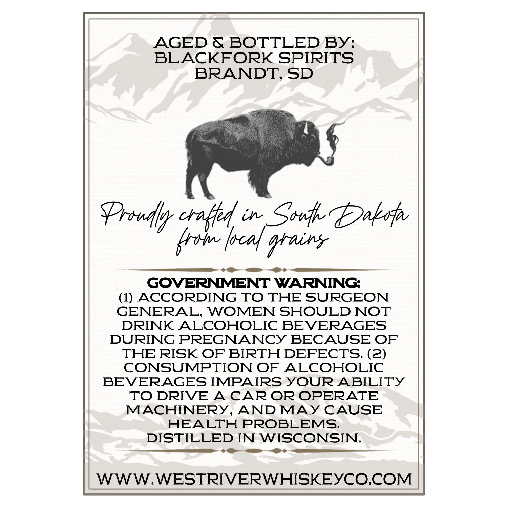
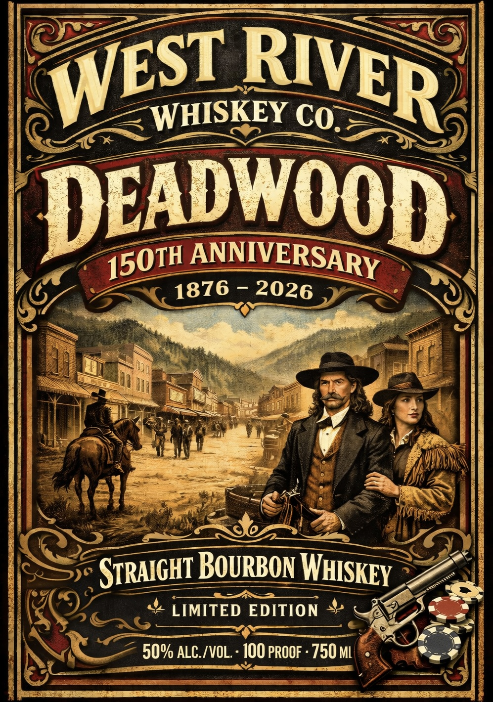

# TTB COLA Label Images - TTBID 26037001000208

**Brand Name:** WEST RIVER WHISKEY

**Issue Date:** 02/10/2026

**Origin Code:** 42

**Product Class/Type:** 101

**Source:** [TTB Public COLA Registry](https://ttbonline.gov/colasonline/viewColaDetails.do?action=publicFormDisplay&ttbid=26037001000208)

## Label Images

### Back Label

### Front Label

## Extracted Label Text

*Text extracted via OCR - may contain errors*

*1 image(s) excluded: text did not meet readability threshold*

### Back Label

AGED & BOTTLED By:
BLACKFORK SPIRITS
BRANDT, SD

Y / Boe W
alg sh aes

+ me
GOVERNMENT WARNING:

(1) ACCORDING TO THE SURGEON
GENERAL, WOMEN SHOULD NOT
DRINK ALCOHOLIC BEVERAGES
DURING PREGNANCY BECAUSE OF
THE RISK OF BIRTH DEFECTS. (2)
CONSUMPTION OF ALCOHOLIC
BEVERAGES IMPAIRS YOUR ABILITY
TO DRIVE A CAR OR OPERATE
MACHINERY, AND MAY CAUSE
HEALTH PROBLEMS.
DISTILLED IN WISCONSIN.

ce <> <P

WWW.WESTRIVERWHISKEYCO.COM
