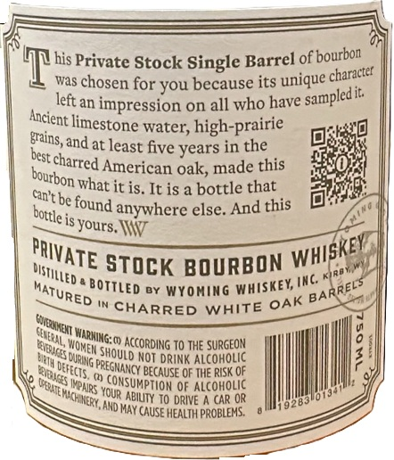
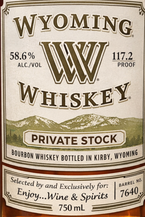
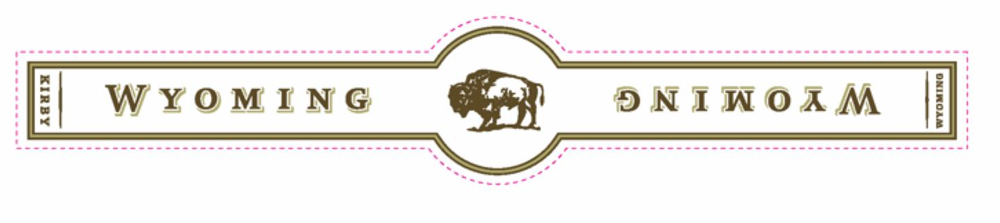

# TTB COLA Label Images - TTBID 26037001000226

**Brand Name:** WYOMING WHISKEY

**Fanciful Name:** PRIVATE STOCK 117.2

**Issue Date:** 03/11/2026

**Origin Code:** 49

**Product Class/Type:** 141

**Source:** [TTB Public COLA Registry](https://ttbonline.gov/colasonline/viewColaDetails.do?action=publicFormDisplay&ttbid=26037001000226)

## Label Images

### Back Label

### Front Label

### Label 2

## Extracted Label Text

*Text extracted via OCR - may contain errors*

**Detected Proof:** 117.2

### Back Label

his Private Stock Single Barrel of)
was chosen for you because its unique =
left an impression on all who have
water;
high-prairie
Bains,and at least five years in the
best
American oak, made this
what it is. It is a bottle that
Can't be
anywhere else. And this
is yours. IW
StocK BOURBONKWG %5
Wyohing
CHARRED WHITE
according To The SURGEON
NOT drink ALcoholic
2
BECAuse OF THE RISK OF
Tion OF Alcoholic
ABIUty T0 dRIVE
CAR OR
ANd May CAUSE Health Problems.
Fbourbon
character
'sampled i
Ancient "
limestone-
charred
bourbon -
found
bottle `
WHISKEY
PRIVATE
~Dstilled =
BOTTLEd
Whiskey
BARRELS
Katured
OAK
DDRXI !
{ril
WarminG: @ [
Womem
0i3e
should
Durg [
PREGWANCY
defects.
Vvalis !
cOnsumpi
Wrbhe Hch Wers ,
Wpars -
YOUR
0283'

### Front Label

FATYOMING

WYOMI

=)

iG

58.6%

117.2

ALC/VOL

PROOF

i

i

W

WHIskEY

bee

i

SSE eee

OURBON WHISKEY BOTTLED IN KIRBY, wyoniNne

Se

lected by and Exclusively for!

parrel

Njoy...Wine & Spi

ba

750 mL

OA

### Label 2

ocees

owen wenn www ec es wen cen enccescns ens cccescses

freemen e me wwe wen cnn emcee cnc ewes cece scsccceccees

=

a

WYOMING

SNIWOAM

3

cans cacsen nnn 60606 Sen echcnesnsasesensessuseeey

8 OS ae 660865 655s 6058 5e5En SOS en eeeeees Hes Seees

ween ee
