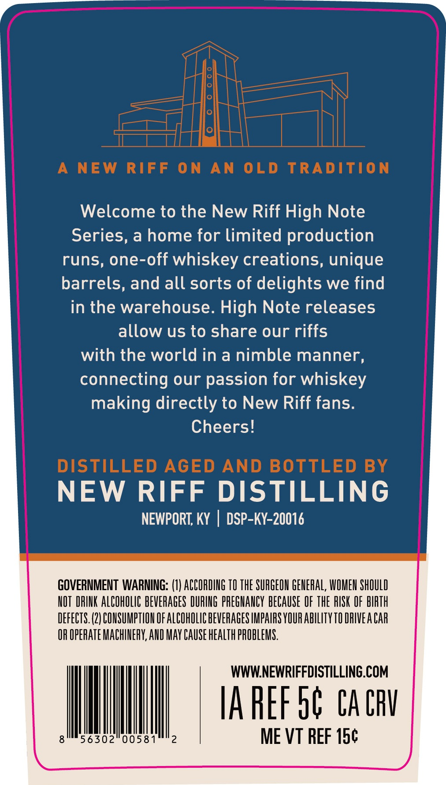
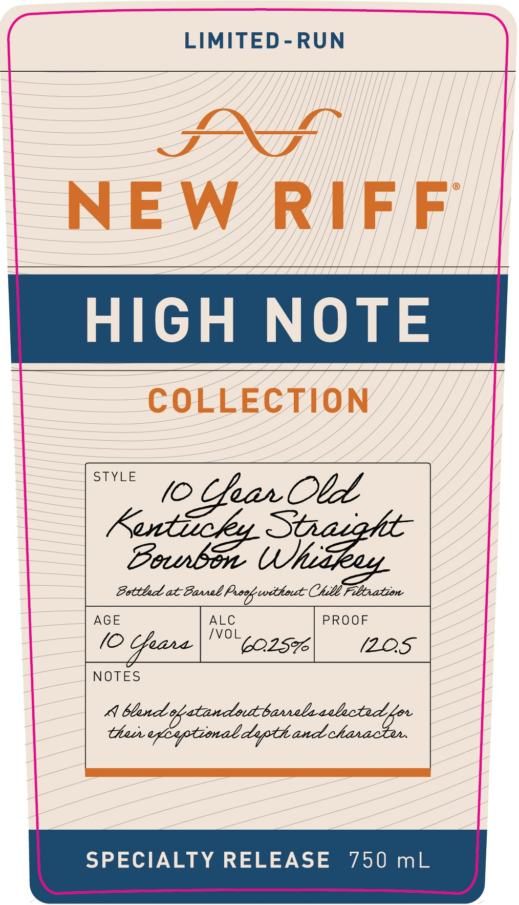

# TTB COLA Label Images - TTBID 26037001000262

**Brand Name:** NEW RIFF

**Issue Date:** 02/10/2026

**Origin Code:** 22

**Product Class/Type:** 101

**Source:** [TTB Public COLA Registry](https://ttbonline.gov/colasonline/viewColaDetails.do?action=publicFormDisplay&ttbid=26037001000262)

## Label Images

### Back Label

### Front Label

### Label 3

## Extracted Label Text

*Text extracted via OCR - may contain errors*

### Back Label

a aan.

Welcome to the New Riff High Note

Series, a home for limited production

runs, one-off whiskey creations, unique

barrels, and all sorts of delights we find

in the warehouse. High Note releases

allow us to share our riffs

with the world in a nimble manner,

connecting our passion for whiskey

making directly to New Riff fans.

Cheers!

NEW RIFF DISTILLING

NEWPORT, KY | DSP-KY-20016

GOVERNMENT WARNING: (1) ACCORDING 10 THE SURGEON GENERAL, WOMEN SHOULD

NOT DRINK ALCOHOLIC BEVERAGES DURING PREGNANCY BECAUSE OF THE RISK OF BIRTH

DEFECTS. (2) CONSUMPTION OF ALCOHOLIC BEVERAGES IMPAIRS YOUR ABILITY 10 DRIVEA CAR

OR OPERATE MACHINERY, AND MAY CAUSE HEALTH PROBLEMS.

WWW.NEWRIFFDISTILLING.COM

[AREF ob CACRY

8

56302 00581

Ill

2

ME VT REF 15¢

### Front Label

eee

E

.

:

R

IFF

HIGH NOTE

COLLECTION yy

— (0

> ar. Old

Betthad at Passel Proepcvithout Chill Filtration

Babee Use

AGE

ALC

/VOL

PROOF

(0 Cheare

COLS%6

(ZOOS

NOTES

annele

a bland yatandott

thar egbyptional dypth

SPECIALTY RELEASE 750 mL

### Label 3

HE
