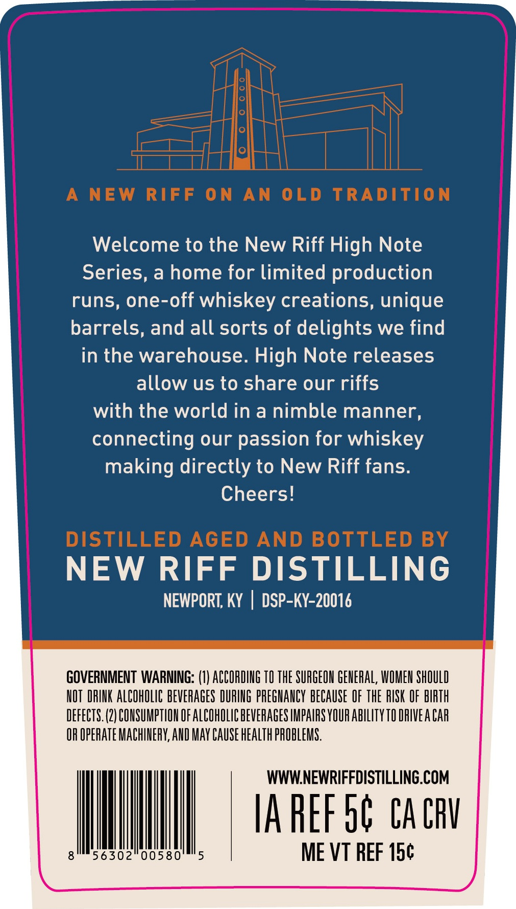
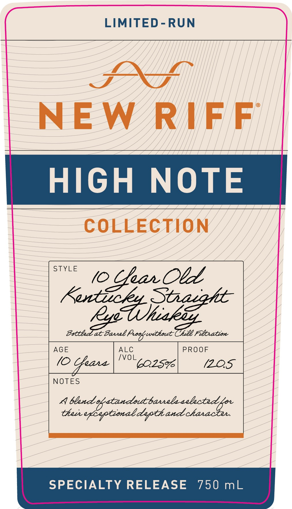
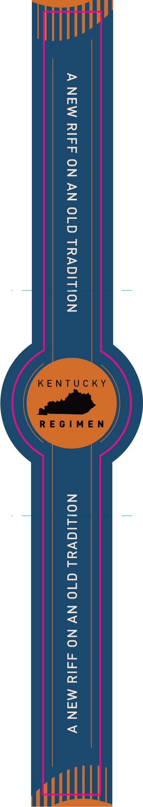

# TTB COLA Label Images - TTBID 26037001000271

**Brand Name:** NEW RIFF

**Issue Date:** 02/10/2026

**Origin Code:** 22

**Product Class/Type:** 102

**Source:** [TTB Public COLA Registry](https://ttbonline.gov/colasonline/viewColaDetails.do?action=publicFormDisplay&ttbid=26037001000271)

## Label Images

### Back Label

### Front Label

### Label 2

## Extracted Label Text

*Text extracted via OCR - may contain errors*

### Back Label

(i ann

Welcome to the New Riff High Note

Series, a home for limited production

runs, one-off whiskey creations, unique

barrels, and all sorts of delights we find

in the warehouse. High Note releases

allow us to share our riffs

with the world in a nimble manner,

connecting our passion for whiskey

making directly to New Riff fans.

Cheers!

NEW RIFF DISTILLING

NEWPORT, KY | DSP-KY-20016

GOVERNMENT WARNING: (1) ACCORDING 10 THE SURGEON GENERAL, WOMEN SHOULD

NOT DRINK ALCOMOLIC BEVERAGES DURING PREGNANCY BECAUSE OF THE RISK OF BIRTH

DEFECTS. (2) CONSUMPTION OF ALCOHOLIC BEVERAGES IMPAIRS YOUR ABILITY 10 DRIVEA CAR

OR OPERATE MACHINERY, AND MAY CAUSE HEALTH PROBLEMS.

WWW.NEWRIFFDISTILLING.COM

[AREF ob CACRV

8

56302 005805

Ill

ME VT REF 15¢

### Front Label

LIMITED-RUN

=u il

NEW RIFF

HIGH NOTE

COLLECTION”

Sind

Pe dar Cid Obl

ec

(O care ee

PROOF

(ZO5

NOTES

A bland of tana barbs

SPECIALTY RELEASE 750 mL

### Label 2

HE
