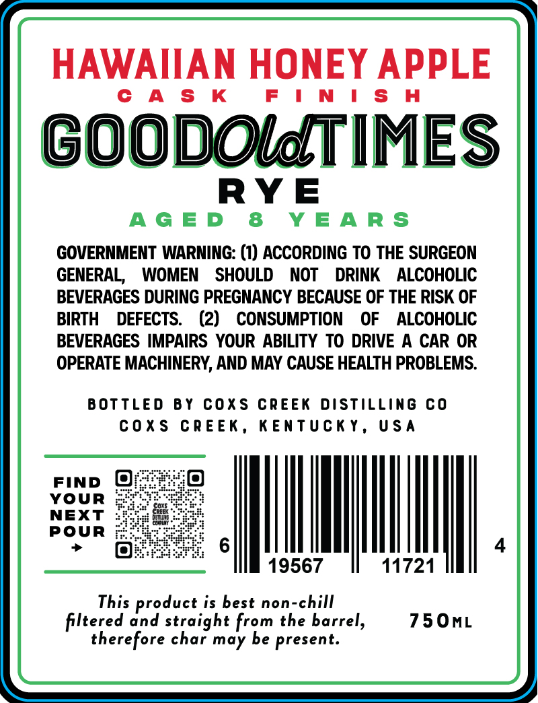
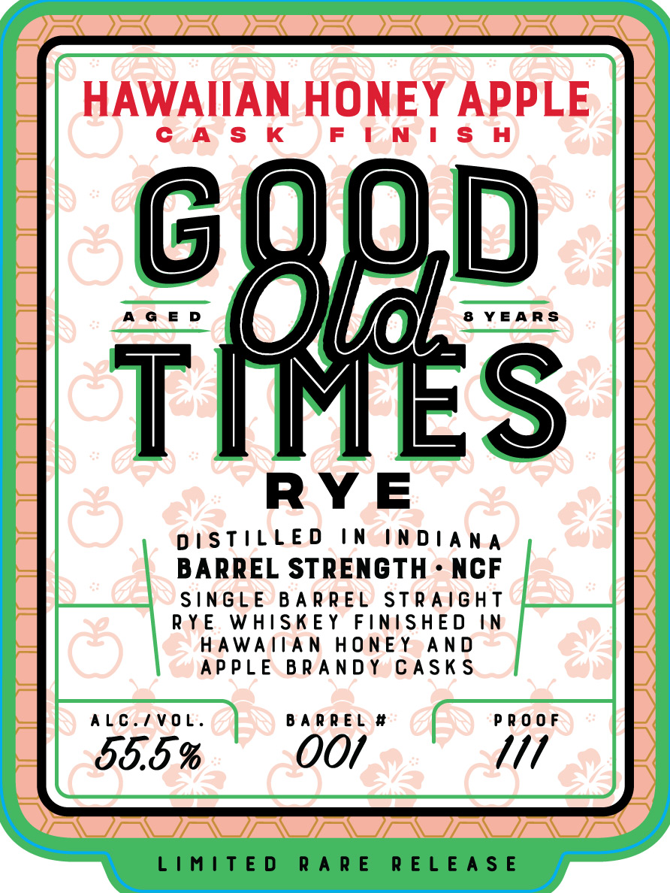

# TTB COLA Label Images - TTBID 26037001000288

**Brand Name:** GOOD OLD TIMES RYE

**Fanciful Name:** HAWAIIAN HONEY APPLE

**Issue Date:** 02/10/2026

**Origin Code:** 22

**Product Class/Type:** 102

**Source:** [TTB Public COLA Registry](https://ttbonline.gov/colasonline/viewColaDetails.do?action=publicFormDisplay&ttbid=26037001000288)

## Label Images

### Back Label

### Front Label

## Extracted Label Text

*Text extracted via OCR - may contain errors*

### Back Label

HAWAIIAN HONEY APPLE

CAS K

FINISH

GOODOldTIMES

RYE

AGED 8 YEARS

GOVERNMENT WARNING: (1) ACCORDING TO THE SURGEON

GENERAL, WOMEN SHOULD NOT DRINK ALCOHOLIC

BEVERAGES DURING PREGNANCY BECAUSE OF THE RISK OF

BIRTH DEFECTS. (2) CONSUMPTION OF ALCOHOLIC

BEVERAGES IMPAIRS YOUR ABILITY TO DRIVE A CAR OR

OPERATE MACHINERY, AND MAY CAUSE HEALTH PROBLEMS.

BOTTLED BY COXS CREEK DISTILLING CO

COXS CREEK, KENTUCKY, USA

FIND @

YOUR

NEXT

POUR

MOI.

!

19567

11721

This product is best non-chill

750mL

filtered and straight from the barrel,

therefore char may be present.

### Front Label

HAWAIIAN HONEY APPLE
CASK FINISH
AGED OVE! 8 YEARS
RYE
DISTILLED IN INDIANA
BARREL STRENGTH - NCF
SINGLE BARREL STRAIGHT
RYE WHISKEY FINISHED IN
HAWAIIAN HONEY AND
APPLE BRANDY CASKS
ALC./VOL. BARREL # PROOF
55.5 % OO/ 1/1
LIMITED RARE RELEASE
