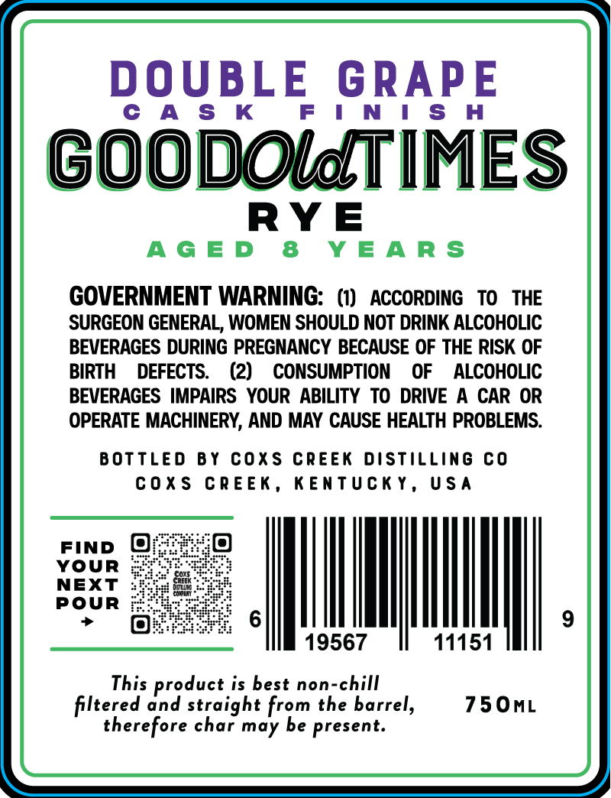
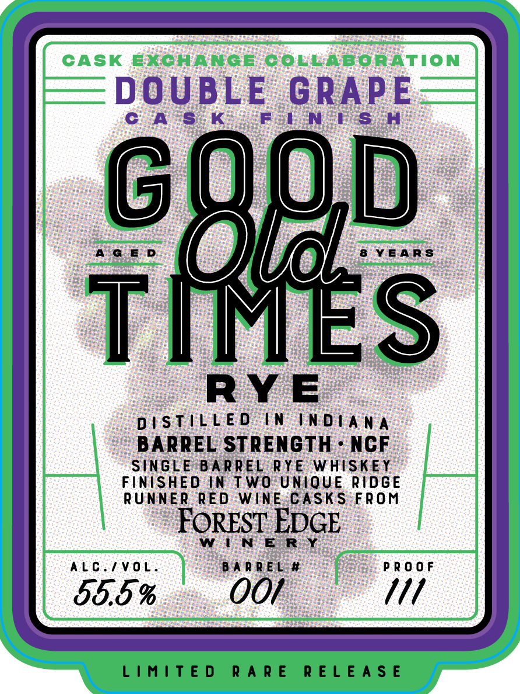

# TTB COLA Label Images - TTBID 26037001000303

**Brand Name:** GOOD OLD TIMES RYE

**Fanciful Name:** DOUBLE GRAPE

**Issue Date:** 02/10/2026

**Origin Code:** 22

**Product Class/Type:** 102

**Source:** [TTB Public COLA Registry](https://ttbonline.gov/colasonline/viewColaDetails.do?action=publicFormDisplay&ttbid=26037001000303)

## Label Images

### Back Label

### Front Label

## Extracted Label Text

*Text extracted via OCR - may contain errors*

### Back Label

DOUBLE G

CAS K

RAPE

GOODOldTIMES

RYE

AGED 8 YEARS

GOVERNMENT WARNING: (1) ACCORDING TO THE

SURGEON GENERAL, WOMEN SHOULD NOT DRINK ALCOHOLIC

BEVERAGES DURING PREGNANCY BECAUSE OF THE RISK OF

BIRTH DEFECTS. (2) CONSUMPTION OF ALCOHOLIC

BEVERAGES IMPAIRS YOUR ABILITY TO DRIVE A CAR OR

OPERATE MACHINERY, AND MAY CAUSE HEALTH PROBLEMS.

BOTTLED BY COXS CREEK DISTILLING CO

COXS CREEK, KENTUCKY, USA

FIND @

YOUR

NEXT

POUR

LN

|

19567

11151

This product is best non-chill

750mL

filtered and straight from the barrel,

therefore char may be present.

### Front Label

DOUBLE GRAPE

Cc A'S K

Fol nN PSs :H

0

AGED

8 YEARS

OSes

\

RYE

DISTILLED IN INDIANA

BARREL STRENGTH - NCF

SINGLE BARREL RYE WHISKEY

FINISHED IN TWO UNIQUE RIDGE

RUNNER RED WINE:CASKS FROM

FOREST EDGE

WEN ER

ALC./VOL.

BARREL #

PROOF

58.5 %

OO/

///

LIMITED RARE RELEASE
