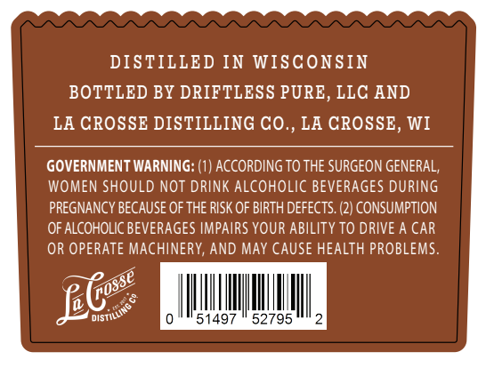
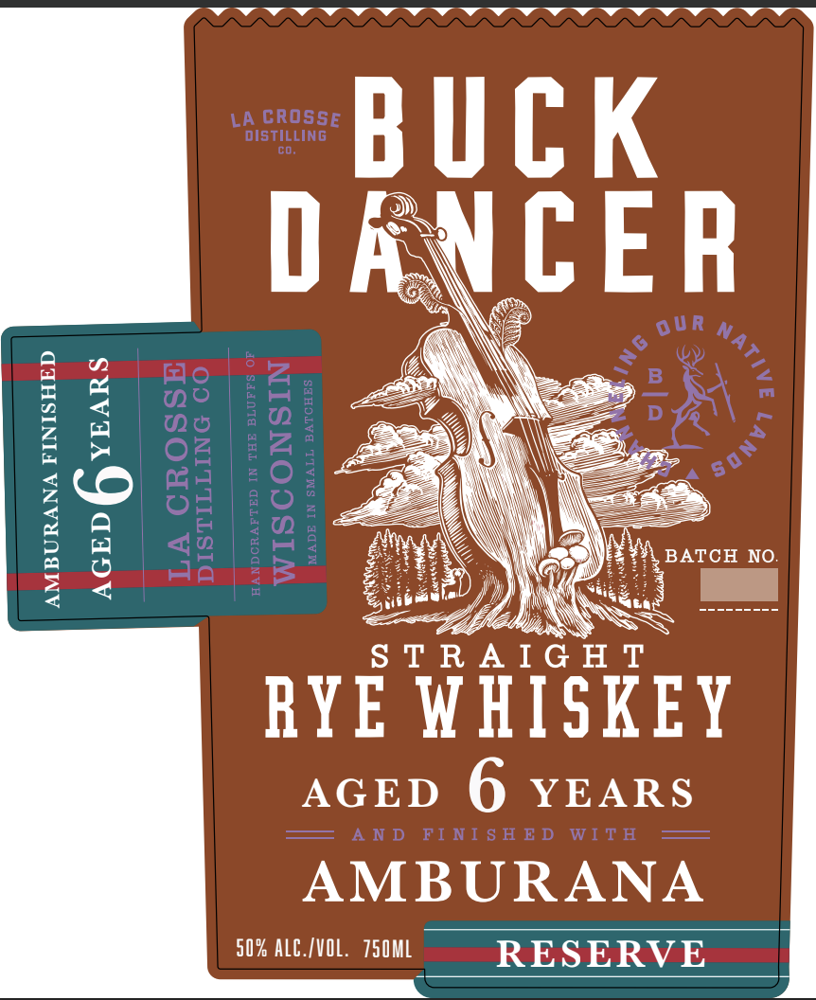

# TTB COLA Label Images - TTBID 26037001000618

**Brand Name:** BUCK DANCER

**Issue Date:** 02/10/2026

**Origin Code:** 48

**Product Class/Type:** 102

**Source:** [TTB Public COLA Registry](https://ttbonline.gov/colasonline/viewColaDetails.do?action=publicFormDisplay&ttbid=26037001000618)

## Label Images

### Back Label

### Front Label

## Extracted Label Text

*Text extracted via OCR - may contain errors*

### Back Label

DISTILLED IN WISCONSIN

BOTTLED BY DRIFTLESS PURE, LLC AND

LA CROSSE DISTILLING CO., LA CROSSE, WI

GOVERNMENT WARNING: (1) ACCORDING TO THE SURGEON GENERAL,

WOMEN SHOULD NOT DRINK ALCOHOLIC BEVERAGES DURING

PREGNANCY BECAUSE OF THE RISK OF BIRTH DEFECTS. (2) CONSUMPTION

OF ALCOHOLIC BEVERAGES IMPAIRS YOUR ABILITY TO DRIVE A CAR

OR OPERATE MACHINERY, AND MAY CAUSE HEALTH PROBLEMS.

es

09>

IM

ll

lI

Jl!

1497

52795

ll.

### Front Label

vvwwwvwWwWvwWwWwWwWwWYvWwWwWwWYWwWwWwWw

BUCK

>

Se)

CER

Q

‘

BATCH NO.

\

ea

as

TRAIGH

RYE WHISKEY

AGED 6 YEARS

AMBURANA

50% ALC./VOL. 750ML

RESERVE
