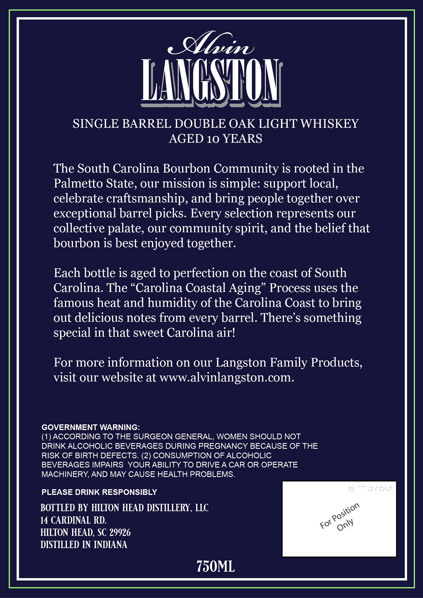
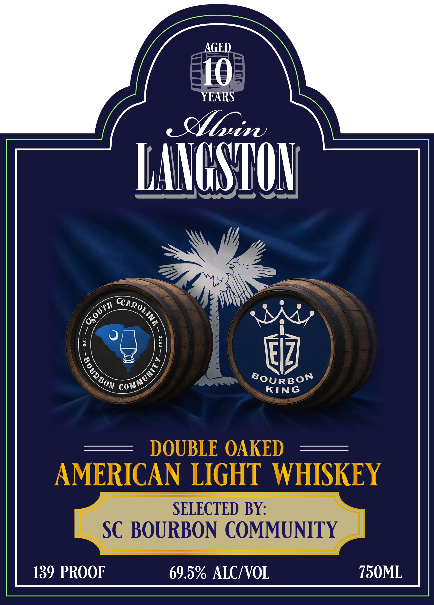

# TTB COLA Label Images - TTBID 26037001000689

**Brand Name:** ALVIN LANGSTON

**Issue Date:** 02/10/2026

**Origin Code:** 41

**Product Class/Type:** 144

**Source:** [TTB Public COLA Registry](https://ttbonline.gov/colasonline/viewColaDetails.do?action=publicFormDisplay&ttbid=26037001000689)

## Label Images

### Back Label

### Front Label

## Extracted Label Text

*Text extracted via OCR - may contain errors*

### Back Label

SINGLE BARREL DOUBLE OAK LIGHT WHISKEY

AGED 10 YEARS

The South Carolina Bourbon Community is rooted in the

Palmetto State, our mission is simple: support local,

celebrate craftsmanship, and bring people together over

exceptional barrel picks. Every selection represents our

collective palate, our community spirit, and the belief that

bourbon is best enjoyed together.

Each bottle is aged to perfection on the coast of South

Carolina. The “Carolina Coastal Aging” Process uses the

famous heat and humidity of the Carolina Coast to bring

out delicious notes from every barrel. There’s something

special in that sweet Carolina air!

For more information on our Langston Family Products,

visit our website at www.alvinlangston.com.

GOVERNMENT WARNING:

(1) ACCORDING TO THE SURGEON GENERAL, WOMEN SHOULD NOT

DRINK ALCOHOLIC BEVERAGES DURING PREGNANCY BECAUSE OF THE

RISK OF BIRTH DEFECTS. (2) CONSUMPTION OF ALCOHOLIC.

BEVERAGES IMPAIRS YOUR ABILITY TO DRIVE A CAR OR OPERATE

MACHINERY, AND MAY CAUSE HEALTH PROBLEMS.

PLEASE DRINK RESPONSIBLY

BOTTLED BY HILTON HEAD DISTILLERY, LLC

ge

14 CARDINAL RD.

HILTON HEAD, SC 29926

xo om

DISTILLED IN INDIANA

730ML

### Front Label

——_

AGED

10.

YEARS

a

Whi

Y

—-

——S—

Ty

¥ CAR?

Wty

is)

G,

‘$

8oyu

t

RBO

y

KING

~

SELECTED BY:

)

Lf

Se

|

b

.

JRBON

(

x

\

“

B

A

] \

|

NA

'U)

x

NITY

139 PROOF

69.9% ALC/VOL

700ML
